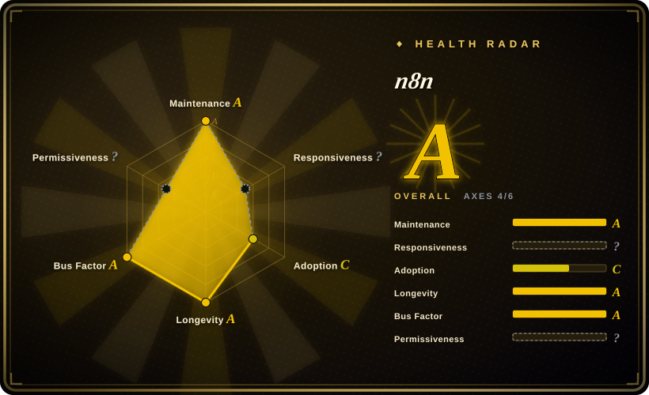
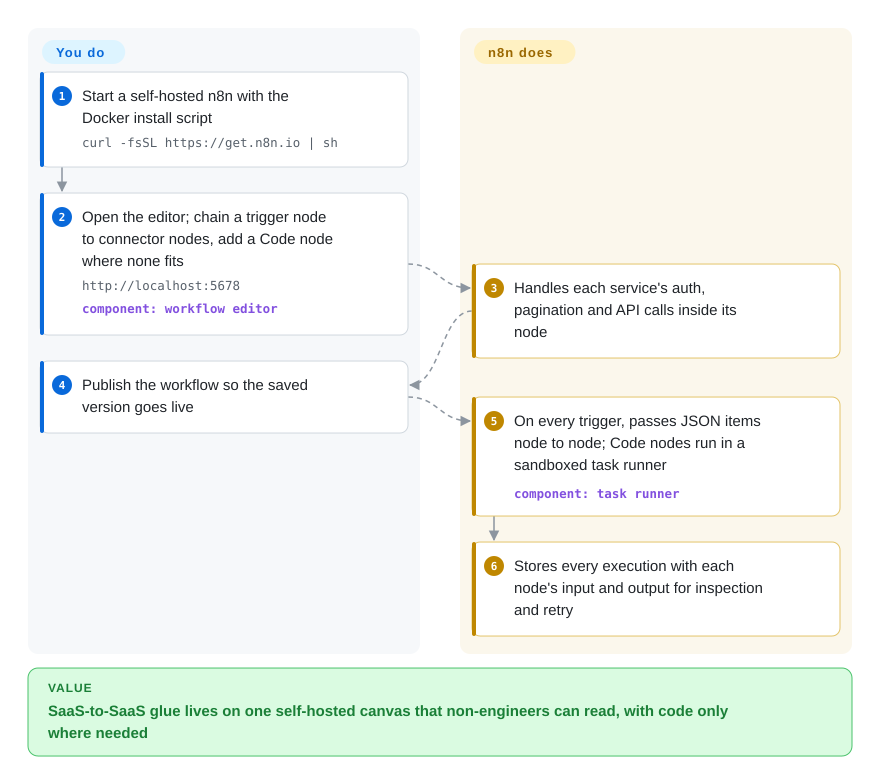

# n8n

Every new SaaS your company adopts means another hand-written script that copies rows from one API to another — and when a token expires at 2 a.m. nobody notices until a customer does. n8n puts those integrations on a visual canvas you self-host: drag a trigger and ready-made connector nodes together, drop into JavaScript or Python where the nodes run out, and it runs the chain on every event and keeps a per-node record of what went in and out.

## When to use

You're on a small ops or internal-tools team, and the backlog is all glue: when a Typeform submission arrives, enrich it from the CRM, post a Slack summary, and open a Jira ticket; every night, pull invoices from Stripe into a Postgres table. Each one is a 200-line script with its own retry bug, and the business people who own the process can't read any of it. You want those flows somewhere a non-engineer can see and edit the steps, but you also need to self-host because the data is customer data, and you need a code escape hatch for the one transformation no connector covers. n8n gives you a canvas of 1500+ integration nodes (as listed in the 2026-10 README), Code nodes for JavaScript/Python, and AI-agent nodes for LLM steps, all running on your own server.

Pick n8n over Zapier or Make when self-hosting and code escape hatches matter more than zero ops — those are hosted products you cannot run yourself. Pick it over Airflow, Prefect or Temporal when the work is *integration plumbing between SaaS APIs* rather than data pipelines or durable application logic written as code: those tools give you no connector catalog and no canvas a non-engineer can follow. The deciding tradeoff is prototyping speed on a visual canvas plus a real-code escape hatch, paid for with a fair-code license instead of an OSI one.

## How it works

n8n is one Node.js application that serves a browser editor, stores workflows and execution history in a database, and runs workflows when their trigger fires. A *workflow* is a chain of nodes on the canvas: one trigger node (a schedule, a webhook URL, a new row in an app) followed by action nodes, each of which receives a list of JSON *items* — records — from the previous node and passes its output to the next. The connectors are what n8n does for you: authentication, pagination and API calls to 1500+ services ship as nodes, so you configure fields instead of writing HTTP code. What you do is wire the nodes, store the credentials, and write Code-node snippets where no connector fits; since 2.0, those snippets run in a separate *task runner* process (a sandbox next to the main app), and Python Code nodes need the separate `n8nio/runners` image. Since 2.0 a workflow goes live only when you **Publish** it, so editing a draft no longer changes what production runs. Scaling past one process — *queue mode* — is your job too: a Redis queue plus worker processes.

<!-- flow-steps:begin (generated from flows/n8n.json by tools/flow_card.py — do not edit) -->

Text version of the flow

1. **You**: Start a self-hosted n8n with the Docker install script — `curl -fsSL https://get.n8n.io | sh`
2. **You**: Open the editor; chain a trigger node to connector nodes, add a Code node where none fits — `http://localhost:5678` — component: `workflow editor`
3. **n8n**: Handles each service's auth, pagination and API calls inside its node
4. **You**: Publish the workflow so the saved version goes live
5. **n8n**: On every trigger, passes JSON items node to node; Code nodes run in a sandboxed task runner — component: `task runner`
6. **n8n**: Stores every execution with each node's input and output for inspection and retry

**Value**: SaaS-to-SaaS glue lives on one self-hosted canvas that non-engineers can read, with code only where needed

<!-- flow-steps:end -->

## When NOT to use

- **You need an OSI-approved license, or you want to resell or embed it.** n8n's Sustainable Use License allows use "only for your own internal business purposes or for non-commercial or personal use"; files marked `.ee` need a paid Enterprise license. If you are building a product that offers automation to your own customers, use Node-RED (Apache-2.0, not indexed) or a code-first engine such as [Prefect](prefect.md) (Apache-2.0) instead of n8n, because the license rather than the code is the blocker.
- **You need sub-second event or stream processing.** n8n runs each execution through a database-backed engine; for high-volume streams use Kafka plus Flink (not indexed) instead, because they are built for continuous low-latency processing.
- **The workflow is really application logic that must survive crashes for days** (order sagas, payment retries, human approvals inside your product). Use [Temporal](temporal.md) instead of n8n, because Temporal's durable execution persists every step of code you own and replays it after a failure, whereas n8n is an integration tool you call from the outside.
- **Your team only writes code and reviews everything in Git.** For CI/CD or Kubernetes job pipelines use [Argo Workflows](argo-workflows.md) or GitHub Actions, and for Python data pipelines use [Airflow](airflow.md) or [Prefect](prefect.md), instead of n8n, because workflows stored as canvas JSON diff poorly and the editor is the main authoring surface.
- **You run it via `npm`/`npx`, or on MySQL.** 2.0 dropped MySQL/MariaDB as the storage backend, and the published 3.0 breaking-change notes (3.0 slated for October 2026) say self-hosted n8n will require a Docker-based deployment. If you cannot run containers, use Node-RED (an npm-installable flow tool) instead of planning a new n8n install.
- **One or two HTTP calls on a timer.** A cron job plus a short script is less to operate than an n8n server, its database and backups.

## Comparison

| Alternative | In index | Our verdict | Tradeoff |
| --- | --- | --- | --- |
| [Apache Airflow](airflow.md) | ✅ | For scheduled batch data pipelines written as Python DAGs, pick Airflow; for SaaS-to-SaaS integrations a non-engineer must be able to read, pick n8n. | Airflow brings an Apache-2.0 license, provider packages and backfills; it has no visual editor and no 1500-node connector catalog, so each integration is code you write. |
| [Prefect](prefect.md) | ✅ | When Python developers own the workflow and want plain decorated functions under an Apache-2.0 license, pick Prefect; pick n8n when pre-built connectors and a canvas matter more than code review. | Prefect keeps everything in Python and Git; you write every API call yourself and get no drag-and-drop editor. |
| [Temporal](temporal.md) | ✅ | When the flow is business logic inside your product that must resume after crashes, pick Temporal; pick n8n for internal glue between existing SaaS tools. | Temporal gives durable, replayable execution of your own code in several languages; it needs a server cluster and SDK knowledge, with no connector nodes. |
| Node-RED | not indexed | When you need a self-hosted visual flow tool under Apache-2.0 (IoT, home automation, or reselling), pick Node-RED; pick n8n when business-SaaS connectors, AI nodes and per-execution history matter more. | Node-RED is permissively licensed and installs from npm; its connector catalog is device/IoT-oriented and community-maintained. |
| Zapier / Make | not a repo | When nobody on the team should run a server and per-task pricing is acceptable, use the hosted products; pick n8n when data must stay on your infrastructure. | Hosted closed-source SaaS: zero ops and polished connectors, but no self-hosting and no code-level extension. |

## Tech stack

- **TypeScript on Node.js** — a pnpm monorepo; the root `package.json` declares `node >= 24` for development (2026-10).
- **Vue + Pinia** — the browser workflow editor (`packages/frontend/editor-ui`).
- **Express + TypeORM** — HTTP server and database layer of `packages/cli`.
- **PostgreSQL or SQLite** — workflow, credential and execution storage; 2.0 removed MySQL/MariaDB and made the pooling SQLite driver the only SQLite driver.
- **Bull + Redis** — job queue for queue mode (`bull`, `ioredis` in `packages/cli`).
- **Task runners** — separate JavaScript/Python processes (`n8nio/runners` image) that execute Code nodes, on by default since 2.0.

## Dependencies

- **Docker** — the README's quick start (`curl -fsSL https://get.n8n.io | sh`, or `docker run … docker.n8n.io/n8nio/n8n`) requires it, and per the 3.0 notes it becomes the only supported self-hosted path.
- **Database** — SQLite for a single box; PostgreSQL for anything production or multi-instance.
- **Redis + worker processes** — only in queue mode, when one process can no longer keep up.
- **`n8nio/runners` container** — needed for Python Code nodes and for running task runners in external mode.
- **Reverse proxy with TLS** — webhook triggers need a public HTTPS URL if outside services call in.
- **Credentials for every connected SaaS** — stored encrypted in n8n's database; losing the encryption key loses the credentials.

## Ops difficulty

**Medium.** A single Docker container with SQLite runs in minutes. Production adds PostgreSQL with backups, a TLS reverse proxy for webhooks, an encryption key you must not lose, task-runner containers for Python, and — at higher volume — Redis plus workers in queue mode. Upgrades need attention: the 2.0 notes list removed nodes, changed defaults (task runners on, environment-variable access blocked in Code nodes, ExecuteCommand disabled) and dropped MySQL, and 3.0 removes the npm install path. Releases ship several times a week (2.42.4 and 2.42.5 on consecutive days in 2026-10), so pin a version rather than tracking `stable`.

## Health & viability

- **Maintenance**: Grade A — commits in all 13 of the last 13 weeks, last commit the day of the 2026-10-08 re-score; stable releases land several times a week, and the 1.x line still receives patch releases (1.123.84 on 2026-10-08) alongside 2.x.
- **Responsiveness**: Cannot be scored — the scorer found no usable recent issue/PR response window this run (`no_window_signal`).
- **Adoption**: Grade C — the scorer now reads the `n8n` npm package (408,701 downloads last month, 124 dependent repositories, 2026-10-09), but most installs are Docker pulls it does not count; ~207k GitHub stars and ~61k forks (2026-10) point to a much larger footprint than the grade suggests.
- **Longevity**: Grade A — 2665 days old (created 2019-06, ~7.3 years) and shipping daily: old enough and active enough for a solid Lindy prior.
- **Governance**: Grade A — 197 active contributors in the trailing 12 months, top-3 share 12.3%; the roadmap is owned by a single company, n8n GmbH, which also sells the cloud and enterprise editions.
- **Risk / License**: Cannot be scored — the Sustainable Use License is not an SPDX license (`license_unparsed`). It is the main risk flag: source-available, internal-use-only for commercial users, with enterprise features (`.ee` files) behind a paid license.

## Caveats (unverified)

- [未验证] The "1500+ integrations" and "9,000+ templates" figures are the 2026-10 README's; they include community nodes and templates whose quality and maintenance vary.
- [未验证] n8n 3.0's date and final scope (Docker-only self-hosting, removed nodes) are from the pre-release breaking-changes page; they may change before release.
- [推断] How long the 1.x line keeps receiving patch releases after 3.0 ships is not stated in the sources read.
- [推断] The Adoption grade understates real usage because Docker pulls of the n8n image were not counted; only the npm package was.
- [未验证] Node-RED's description here (Apache-2.0 per the GitHub API; npm install; an IoT/device-leaning, community-maintained node catalog) was not re-read from its docs for this sync.
- [推断] n8n GmbH's cloud pricing and the split between community and enterprise features may shift as the company pursues revenue.
