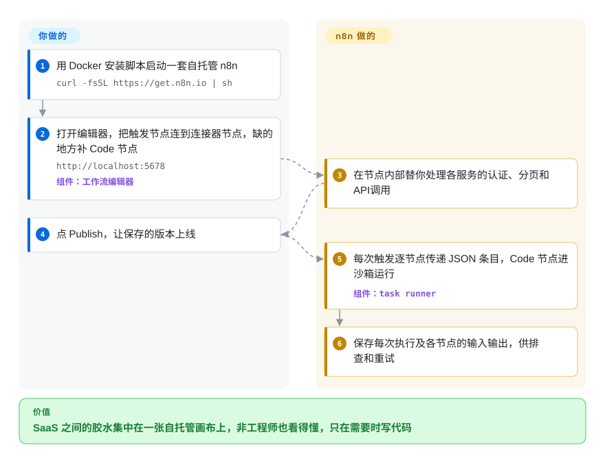

# n8n

公司每接入一个新 SaaS，就多一段把数据从一个 API 搬到另一个 API 的手写脚本；某天凌晨两点 token 过期，没人察觉，直到客户来投诉。n8n 把这些集成搬到一张你自己部署的可视化画布上：把触发器和现成的连接器节点拖在一起，节点不够用的地方写 JavaScript 或 Python，它在每次事件到来时跑完整条链路，并把每个节点的输入输出都记下来。

## 何时使用

你在一个小型运维或内部工具团队，待办里全是“胶水”活：Typeform 来了一条提交，就去 CRM 补全客户信息、在 Slack 发摘要、再开一张 Jira 工单；每天夜里把 Stripe 的发票拉进一张 Postgres 表。每一件都是 200 行的脚本，各自带着各自的重试 bug，而真正负责流程的业务同事一行也看不懂。你希望这些流程放在一个非工程师也能看懂、能改步骤的地方，但数据是客户数据，必须自托管；而且总有一个转换没有现成连接器，你需要能写代码兜底。n8n 给你一张画布，上面有 1500 多个集成节点（2026-10 README 的数字）、可写 JavaScript/Python 的 Code 节点，以及接大模型的 AI Agent 节点，全部跑在你自己的服务器上。

和 Zapier、Make 比，当自托管和代码兜底比“零运维”更重要时选 n8n——那两个是托管产品，你没法自己部署。和 Airflow、Prefect、Temporal 比，当活儿是 *SaaS API 之间的集成管道*，而不是用代码写的数据管线或需要持久执行的业务逻辑时选 n8n：那几个工具没有连接器目录，也没有非工程师能看懂的画布。决定性的取舍是：可视化画布带来的原型速度，加上真代码兜底；代价是 fair-code 许可证，而不是 OSI 认可的开源许可证。

## 怎么用起来

n8n 是一个 Node.js 应用：提供浏览器里的编辑器，把工作流和执行记录存进数据库，并在触发条件满足时运行工作流。一个*工作流*就是画布上的一串节点：一个触发节点（定时、一个 webhook 地址、某个应用里新增了一行）后面接若干动作节点，每个节点从上一个节点收到一组 JSON *条目*（也就是一条条记录），处理后交给下一个。它替你做的是连接器这部分：对 1500 多个服务的认证、分页、API 调用都已做成节点，你填字段即可，不用写 HTTP 代码。你要做的是连节点、存凭据，以及在没有连接器的地方写 Code 节点片段；从 2.0 起，这些片段跑在独立的 *task runner* 进程里（主程序旁边的一个沙箱），Python 的 Code 节点还需要单独的 `n8nio/runners` 镜像。也是从 2.0 起，工作流要点 **Publish** 才会上线，改草稿不会再影响生产中正在跑的版本。一个进程扛不住时要切到*队列模式*（Redis 队列加若干 worker 进程），这也由你来搭。

<!-- flow-steps:begin (generated from flows/n8n.json by tools/flow_card.py — do not edit) -->

流程文字版

1. **你**：用 Docker 安装脚本启动一套自托管 n8n — `curl -fsSL https://get.n8n.io | sh`
2. **你**：打开编辑器，把触发节点连到连接器节点，缺的地方补 Code 节点 — `http://localhost:5678` — 组件：`工作流编辑器`
3. **n8n**：在节点内部替你处理各服务的认证、分页和 API 调用
4. **你**：点 Publish，让保存的版本上线
5. **n8n**：每次触发逐节点传递 JSON 条目，Code 节点进沙箱运行 — 组件：`task runner`
6. **n8n**：保存每次执行及各节点的输入输出，供排查和重试

**价值**：SaaS 之间的胶水集中在一张自托管画布上，非工程师也看得懂，只在需要时写代码

<!-- flow-steps:end -->

## 何时不用

- **你需要 OSI 认可的许可证，或者想转售、嵌入到自己的产品里。** n8n 的 Sustainable Use License 只允许“为你自己的内部业务目的，或非商业、个人用途”使用；文件名带 `.ee` 的部分还需要付费的企业许可证。如果你要做一个把自动化能力卖给自己客户的产品，请改用 Node-RED（Apache-2.0，未收录）或 [Prefect](prefect.zh.md)（Apache-2.0）这类代码优先的引擎，而不是 n8n，因为卡住你的是许可证，不是代码。
- **你需要亚秒级的事件或流处理。** n8n 的每次执行都经过一个以数据库为后盾的引擎；高吞吐的流请改用 Kafka 加 Flink（未收录），因为它们就是为持续、低延迟处理而设计的。
- **这个流程其实是要扛住崩溃、连续跑几天的应用逻辑**（订单 saga、支付重试、产品内的人工审批）。请改用 [Temporal](temporal.zh.md)，因为 Temporal 的持久执行会把你自己代码的每一步都持久化，故障后重放恢复；而 n8n 是从外部调用的集成工具。
- **你的团队只写代码，一切都在 Git 里评审。** CI/CD 或 Kubernetes 任务流水线请用 [Argo Workflows](argo-workflows.zh.md) 或 GitHub Actions，Python 数据管线请用 [Airflow](airflow.zh.md) 或 [Prefect](prefect.zh.md)，而不是 n8n，因为以画布 JSON 存储的工作流很难 diff，编辑器才是主要的编写界面。
- **你用 `npm`/`npx` 跑它，或者底层是 MySQL。** 2.0 已不再支持 MySQL/MariaDB 作存储后端；已公布的 3.0 破坏性变更说明（3.0 计划于 2026 年 10 月发布）写明自托管 n8n 将只支持基于 Docker 的部署。如果你的环境跑不了容器，请改用 Node-RED（可用 npm 安装的流程工具），不要再新建 n8n 部署。
- **定时调一两个 HTTP 接口而已。** 一个 cron 加一段短脚本，比运维一台 n8n 服务器、它的数据库和备份要省事得多。

## 横向对比

| 替代品 | 是否收录 | 我们的评价 | 取舍 |
| --- | --- | --- | --- |
| [Apache Airflow](airflow.zh.md) | ✅ | 定时跑、用 Python DAG 写的批处理数据管线，选 Airflow；非工程师也要看懂的 SaaS 之间集成，选 n8n。 | Airflow 有 Apache-2.0 许可证、provider 包和回填能力；但没有可视化编辑器，也没有 1500 个节点的连接器目录，每个集成都得自己写代码。 |
| [Prefect](prefect.zh.md) | ✅ | 工作流归 Python 开发者负责、想用 Apache-2.0 许可下的普通装饰器函数时，选 Prefect；现成连接器和画布比代码评审更重要时，选 n8n。 | Prefect 一切都在 Python 和 Git 里；每个 API 调用都得自己写，也没有拖拽式编辑器。 |
| [Temporal](temporal.zh.md) | ✅ | 流程是你产品里必须在崩溃后续跑的业务逻辑时，选 Temporal；在现有 SaaS 工具之间做内部胶水，选 n8n。 | Temporal 用多种语言对你自己的代码做持久、可重放的执行；需要一套服务端集群和 SDK 知识，没有连接器节点。 |
| Node-RED | 未收录 | 需要 Apache-2.0 许可下可自托管的可视化流程工具（物联网、家庭自动化，或要转售）时，选 Node-RED；业务 SaaS 连接器、AI 节点和逐次执行记录更重要时，选 n8n。 | Node-RED 许可宽松，可从 npm 安装；它的节点目录偏设备和物联网方向，由社区维护。 |
| Zapier / Make | 非仓库 | 团队里没人该维护服务器、能接受按任务计费时，用这两个托管产品；数据必须留在自己基础设施上时，选 n8n。 | 闭源托管 SaaS：零运维、连接器打磨得好，但不能自托管，也不能在代码层扩展。 |

## 技术栈

- **TypeScript + Node.js**——pnpm monorepo；根 `package.json` 要求开发环境 `node >= 24`（2026-10）。
- **Vue + Pinia**——浏览器里的工作流编辑器（`packages/frontend/editor-ui`）。
- **Express + TypeORM**——`packages/cli` 里的 HTTP 服务和数据库层。
- **PostgreSQL 或 SQLite**——存工作流、凭据和执行记录；2.0 移除了 MySQL/MariaDB，并把带连接池的 SQLite 驱动定为唯一的 SQLite 驱动。
- **Bull + Redis**——队列模式下的任务队列（`packages/cli` 里的 `bull`、`ioredis`）。
- **Task runner**——执行 Code 节点的独立 JavaScript/Python 进程（`n8nio/runners` 镜像），2.0 起默认开启。

## 依赖

- **Docker**——README 的快速上手（`curl -fsSL https://get.n8n.io | sh`，或 `docker run … docker.n8n.io/n8nio/n8n`）需要它；按 3.0 说明，它将成为唯一受支持的自托管方式。
- **数据库**——单机用 SQLite；生产或多实例用 PostgreSQL。
- **Redis + worker 进程**——只有切到队列模式、单进程扛不住时才需要。
- **`n8nio/runners` 容器**——Python Code 节点以及外部模式的 task runner 需要它。
- **带 TLS 的反向代理**——外部服务要回调 webhook 触发器时，需要一个公网 HTTPS 地址。
- **每个所连 SaaS 的凭据**——加密存在 n8n 的数据库里；丢了加密密钥，凭据也就全丢了。

## 运维难度

**中等。** 单个 Docker 容器加 SQLite，几分钟就能跑起来。生产环境还要加上：带备份的 PostgreSQL、给 webhook 用的 TLS 反向代理、一把绝不能丢的加密密钥、跑 Python 用的 task runner 容器，量大了还要 Redis 加 worker 的队列模式。升级要上心：2.0 说明里列了被移除的节点、改掉的默认值（task runner 默认开启、Code 节点默认禁止读环境变量、ExecuteCommand 节点默认禁用）和被放弃的 MySQL，3.0 又会去掉 npm 安装方式。发布节奏是每周好几次（2026-10 里 2.42.4 和 2.42.5 连着两天发布），所以请锁定具体版本，不要直接跟 `stable` 标签。

## 健康度与可持续性

- **维护活跃度**：Grade A——最近 13 周每周都有提交，2026-10-08 重算当天仍有提交；稳定版每周发布好几次，1.x 线也还在和 2.x 并行出补丁（2026-10-08 发布 1.123.84）。
- **响应速度**：无法计算——本次评分器没有找到可用的近期 issue/PR 响应窗口（`no_window_signal`）。
- **采用广度**：Grade C——评分器读到每月 457,343 次 npm 下载，但取自 `@n8n/utils` 子包而非 `n8n` 主包，而大多数安装走的是它不统计的 Docker 镜像；约 20.7 万 GitHub stars、约 6.1 万 fork（2026-10）说明实际用量远大于这个档位。
- **长青度**：Grade A——仓库已创建 2665 天（2019-06，约 7.3 年），至今每天都在提交：年头够长、也够活跃，Lindy 先验扎实。
- **治理集中度**：Grade A——过去 12 个月 197 位活跃贡献者，前三占比 12.3%；但路线图归一家公司 n8n GmbH 所有，它同时在卖云服务和企业版。
- **许可风险**：无法计算——Sustainable Use License 不是 SPDX 许可证（`license_unparsed`）。这正是最大的风险信号：源码可见，商业用户仅限内部使用，企业功能（`.ee` 文件）要付费许可。

## 存疑（未验证）

- [未验证] “1500 多个集成”“9,000 多个模板”是 2026-10 README 给出的数字，其中包括质量和维护水平参差不齐的社区节点与模板。
- [未验证] n8n 3.0 的发布日期和最终范围（只支持 Docker 自托管、移除哪些节点）来自发布前的破坏性变更页面，正式发布前可能变化。
- [推断] 3.0 发布后 1.x 线还会出多久补丁，所读来源没有说明。
- [推断] 采用广度档位低估了真实用量：评分器的 npm 信号取自一个子包，也没有统计 Docker 拉取量。
- [未验证] 本页对 Node-RED 的描述（GitHub API 显示 Apache-2.0；npm 安装；节点目录偏设备和物联网、由社区维护）本次没有重读其文档核实。
- [推断] n8n GmbH 的云服务定价、社区版与企业版的功能划分，可能随公司追求营收而调整。
