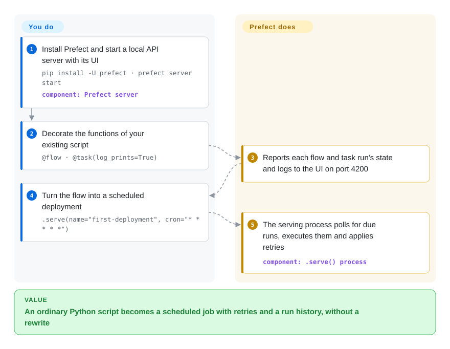

# Prefect

Your Python script runs fine on your laptop, but the moment it has to run every hour you start bolting on a cron line, a retry loop, a log file and a Slack alert — and you still can't say which of last night's runs failed, or why. Prefect lets you keep the script: put `@flow` and `@task` decorators on the functions you already have, and a server schedules them, retries failed steps, and shows every run's state and logs in a web UI.

## When to use

You're a data engineer or ML engineer with a folder of Python scripts that already work: one pulls an API into a warehouse, one retrains a model, one reconciles invoices. Today they run from `0 * * * * python sync.py >> sync.log 2>&1`; when the API times out, the log ends in a `ConnectionResetError` and nobody learns about it until a dashboard is empty. You want retries, schedules, a run history and alerts, but you don't want to rewrite every script into a separate DAG file with its own operator vocabulary. Prefect wraps the functions you have: decorate them, call `.serve(cron=...)` or deploy them to a worker, and the control flow stays ordinary Python — loops, `if` branches and runtime-computed fan-out included.

Pick Prefect over [Airflow](airflow.md) when the team's code is Python and dynamic control flow plus a fast local loop matter more than Airflow's provider catalog and its larger pool of engineers who already know it. Pick it over [Dagster](dagster.md) when you think in *tasks that run* rather than *data assets that must be kept fresh*. Pick it over [Temporal](temporal.md) when the work is a data pipeline, not long-lived application logic that must replay deterministically after a crash. The deciding tradeoff: the lightest path from an existing script to a scheduled, observable job, with Apache-2.0 open source on your side and multi-user team features in the paid Prefect Cloud.

## How it works

Prefect is a Python library plus an API server. You mark the entry function with `@flow` and the steps inside it with `@task`; when the flow runs, the library reports every flow and task *run* — one execution with a state such as Running, Completed, Failed or Retrying — to the API, applies the retries and caching you declared, and streams logs. The API is either a self-hosted server you start with `prefect server start` (SQLite in `~/.prefect/prefect.db` by default, PostgreSQL for production; the UI is on port 4200) or the hosted Prefect Cloud. To run on a schedule you turn a flow into a *deployment* — a named, schedulable entry point: the simplest way is `.serve(...)`, which keeps a process alive that polls the server and runs the flow when it is due; the production way is a *work pool* plus a *worker* process that launches each run on infrastructure you choose (a subprocess, Docker, Kubernetes). Prefect does the bookkeeping — state, schedules, retries, event-driven *automations* (rules such as "if this run fails, notify Slack") — while you supply the code, the server or Cloud account, and whatever machines actually execute the runs.

<!-- flow-steps:begin (generated from flows/prefect.json by tools/flow_card.py — do not edit) -->

Text version of the flow

1. **You**: Install Prefect and start a local API server with its UI — `pip install -U prefect · prefect server start` — component: `Prefect server`
2. **You**: Decorate the functions of your existing script — `@flow · @task(log_prints=True)`
3. **Prefect**: Reports each flow and task run's state and logs to the UI on port 4200
4. **You**: Turn the flow into a scheduled deployment — `.serve(name="first-deployment", cron="* * * * *")`
5. **Prefect**: The serving process polls for due runs, executes them and applies retries — component: `.serve() process`

**Value**: An ordinary Python script becomes a scheduled job with retries and a run history, without a rewrite

<!-- flow-steps:end -->

## When NOT to use

- **Non-engineers need to build the workflows, or the work is mostly SaaS-to-SaaS glue.** Use [n8n](n8n.md) instead of Prefect, because n8n ships a visual canvas and 1500+ connector nodes, while every Prefect integration is Python someone writes.
- **The workflow is long-lived application logic** — an order saga, a payment retry, a human approval that waits for days — and must resume from the exact step after a crash. Use [Temporal](temporal.md) instead of Prefect, because Temporal records every step in an event history and replays your code to restore state, a guarantee Prefect's task-run model does not make.
- **You want data assets, lineage and freshness as the primary model.** Use [Dagster](dagster.md) instead of Prefect, because Dagster is organized around the tables and files a pipeline produces rather than around the tasks that run.
- **You already run a large Airflow estate or need its provider operators and cloud-managed offerings.** Stay on [Airflow](airflow.md) instead of migrating to Prefect, because rewriting working DAGs buys ergonomics, not capability.
- **You need per-user roles, SSO and audit logs on a self-hosted server.** The open-source server's built-in protection is one shared `admin:pass`-style `auth_string`; team, role and SSO features are documented under Prefect Cloud. Budget for Cloud or put your own authenticating proxy in front instead of exposing the OSS server to many teams.
- **Strict no-egress environments that forget configuration.** The client SDK sends anonymous usage telemetry unless `DO_NOT_TRACK` is set or it detects CI; set `DO_NOT_TRACK=1` everywhere rather than assuming an air-gapped install is silent.
- **You need a stable API surface across many years.** Prefect has had two major breaks (2.0 in 2022-08, 3.0 in 2024-09); if you cannot budget a port every couple of years, prefer Airflow's slower-moving, foundation-governed release line.

## Comparison

| Alternative | In index | Our verdict | Tradeoff |
|---|---|---|---|
| [Apache Airflow](airflow.md) | ✅ | For a large estate of scheduled batch DAGs that leans on provider operators and managed cloud offerings, pick Airflow; for turning existing Python scripts into dynamic, observable jobs with little ceremony, pick Prefect. | Airflow has ASF governance, a huge operator catalog and widespread team familiarity; it asks you to restructure code into DAG files and runs more services. |
| [Dagster](dagster.md) | ✅ | When the deliverable is a set of data assets whose lineage and freshness you must track, pick Dagster; when the unit is "run this Python job reliably", pick Prefect. | Dagster gives asset lineage, typing and testability; it asks you to model pipelines as assets and adopt a more opinionated framework. |
| [Temporal](temporal.md) | ✅ | For long-running application workflows that must survive crashes step by step, pick Temporal; for data and ML pipelines in Python, pick Prefect. | Temporal gives deterministic replay and multi-language SDKs; it requires deterministic workflow code and operating a server cluster with its own database. |
| [n8n](n8n.md) | ✅ | When workflows are SaaS integrations that non-engineers should edit on a canvas, pick n8n; when developers own Python code reviewed in Git, pick Prefect. | n8n brings 1500+ connector nodes and a visual editor under a fair-code license; Prefect is Apache-2.0 but every integration is code you write. |
| Flyte | not indexed | When ML pipelines must run as typed, containerized steps on Kubernetes at scale, consider Flyte; when you want to start from plain Python with no cluster, pick Prefect. | Flyte (Apache-2.0) centers on versioned, containerized tasks on Kubernetes; that is heavier to stand up than a local Prefect server. |

## Tech stack

- **Python 3.11–3.14** — `requires-python = ">=3.11,<3.15"` in `pyproject.toml` (2026-10).
- **FastAPI + Starlette + Uvicorn** — the API server; **SQLAlchemy (async) + Alembic** for the database layer and migrations.
- **SQLite (`aiosqlite`) or PostgreSQL (`asyncpg`)** — server storage; PostgreSQL 14.9+ is required to run multiple server instances.
- **Pydantic v2** — flow parameters, settings and API schemas.
- **Optional Redis (`prefect-redis`)** — event messaging, causal ordering and concurrency-lease storage when scaling the server horizontally.
- **Web UI** served by `prefect server start` on port 4200; a slimmer `prefect-client` package exists for processes that only talk to a remote server.

## Dependencies

- **A Python environment** for every process that runs flows (`pip install -U prefect` or `uv add prefect`).
- **An API endpoint** — your own `prefect server start` (SQLite by default), or a Prefect Cloud workspace.
- **PostgreSQL** for any production self-hosted server, and **Redis** if you run more than one server or background-service instance.
- **Execution infrastructure** — a `.serve()` process, or workers polling a work pool that launch runs as subprocesses, Docker containers or Kubernetes jobs.
- **Integration packages** (`prefect-aws`, `prefect-gcp`, etc.) and credentials for whatever systems your tasks touch.

## Ops difficulty

**Low to start, medium in production.** Locally it is one `pip install` and one `prefect server start`. Production self-hosting means a PostgreSQL database with backups and migrations on every upgrade, an authenticating proxy (the OSS server only has a shared basic-auth string), long-lived `.serve()` or worker processes, and — to scale out — Redis plus several server and background-service instances. Prefect Cloud removes the server half but adds a vendor dependency. Releases are frequent (3.8.8 on 2026-10-06, with nightly `.dev` builds), so pin versions and read release notes before upgrading the server and clients together.

## Health & viability

- **Maintenance**: Grade A — commits in all 13 of the last 13 weeks, last commit 1 day before the 2026-10-08 re-score; stable 3.8.x patch releases arrive every week or two (3.8.3 on 2026-08-13 through 3.8.8 on 2026-10-06), with nightly dev builds in between, and the 2.x line still got a patch (2.20.26) on 2026-09-02.
- **Responsiveness**: Grade A — median first response 0.0 hours across 31 qualifying issues; a figure that low suggests automated triage replies rather than a human answer within minutes.
- **Adoption**: Grade A — 6,765,610 PyPI downloads last month and 767 dependent repositories for `prefect`; ~24k GitHub stars (2026-10).
- **Longevity**: Grade A — 3022 days old (created 2018-06) and still shipping daily: a solid Lindy prior, discounted by two incompatible major versions in that span (2.0 in 2022-08, 3.0 in 2024-09).
- **Governance**: Grade C — 138 contributors were active in the trailing 12 months, yet the top contributor holds 66.6% and the top three 83.6% of the scorer's commit window; GitHub's 52-week stats show one core maintainer and AI-agent bot accounts (`devin-ai-integration[bot]`, `claude`) producing most commits. The roadmap belongs to a single vendor — the company that sells Prefect Cloud.
- **Risk / License**: Grade A — Apache-2.0, no relicense in the last 36 months. The softer risk is open-core: team, role and SSO features live in the paid Cloud, and the SDK emits opt-out telemetry.

## Caveats (unverified)

- [推断] The 0.0-hour median first response almost certainly reflects bot or automated triage comments, not human answers; real time-to-fix was not measured.
- [推断] Treating Prefect 2.0 as a port-requiring break for 1.x users rests on the 2.0 release note ("nearly a year of building in public") and the separate 1.x/2.x/3.x documentation lines, not on a migration test.
- [未验证] Which exact features are Cloud-only (RBAC, SSO, audit logs, workspaces) was inferred from the README's link to Cloud team-management docs and the OSS security-settings page; check the current cloud-vs-OSS comparison before deciding.
- [未验证] What the SDK telemetry sends (event names, device id) was read only from `src/prefect/_internal/analytics/` file names and the `DO_NOT_TRACK`/CI checks, not from a network capture.
- [未验证] Flyte's description is from general knowledge plus its GitHub metadata (Apache-2.0, active 2026-10), not a reread of its docs.
