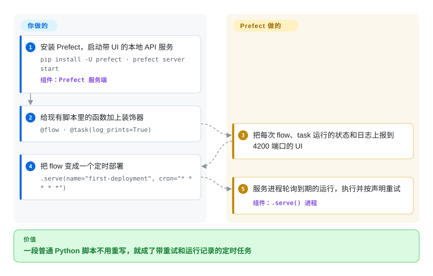

# Prefect

你的 Python 脚本在笔记本上跑得好好的，可一旦要求每小时跑一次，你就得往上加 cron、重试循环、日志文件和 Slack 告警——即便这样，昨晚哪一次失败了、为什么失败，还是说不清。Prefect 让你保留原脚本：给现有函数加上 `@flow` 和 `@task` 装饰器，由一个服务端去排期、重试失败的步骤，并在网页 UI 里展示每次运行的状态和日志。

## 何时使用

你是数据工程师或机器学习工程师，手上有一堆已经能用的 Python 脚本：一个把某个 API 的数据拉进数仓，一个重训模型，一个对账发票。它们现在靠 `0 * * * * python sync.py >> sync.log 2>&1` 运行；API 一超时，日志最后一行就是 `ConnectionResetError`，直到看板空了才有人发现。你想要重试、定时、运行历史和告警，但不想把每个脚本都改写成另一套 DAG 文件、学一整套 operator 词汇。Prefect 直接包住你现有的函数：加上装饰器，调用 `.serve(cron=...)` 或者部署到 worker 上，控制流仍然是普通 Python——循环、`if` 分支、运行时才算出来的并行扇出都照常可用。

和 [Airflow](airflow.zh.md) 比，当团队代码就是 Python、动态控制流和快速的本地调试比 Airflow 的 provider 目录、比“很多工程师已经会用”更重要时，选 Prefect。和 [Dagster](dagster.zh.md) 比，当你思考的单位是“要跑的任务”而不是“要保持新鲜的数据资产”时，选 Prefect。和 [Temporal](temporal.zh.md) 比，当活儿是数据管线，而不是崩溃后必须确定性重放的长生命周期业务逻辑时，选 Prefect。决定性的取舍：从现有脚本到可定时、可观测任务的最短路径，开源部分是 Apache-2.0，多用户协作功能则在付费的 Prefect Cloud 里。

## 怎么用起来

Prefect 是一个 Python 库加一个 API 服务端。你用 `@flow` 标记入口函数，用 `@task` 标记里面的步骤；flow 运行时，库会把每次 flow 和 task 的*运行*（一次执行及其状态，比如 Running、Completed、Failed、Retrying）上报给 API，按你声明的规则做重试和缓存，并实时推送日志。这个 API 可以是你用 `prefect server start` 自己起的服务（默认用 `~/.prefect/prefect.db` 里的 SQLite，生产用 PostgreSQL；UI 在 4200 端口），也可以是托管的 Prefect Cloud。要定时运行，就把 flow 变成一个*部署*（deployment，一个有名字、可排期的入口）：最简单的办法是 `.serve(...)`，它会常驻一个进程，向服务端轮询，到点就执行；生产上的做法是*工作池*（work pool）加 *worker* 进程，由 worker 把每次运行放到你指定的基础设施上（子进程、Docker、Kubernetes）。Prefect 负责记账——状态、排期、重试，以及事件驱动的*自动化*规则（比如“这次运行失败就通知 Slack”）；你负责提供代码、服务端或 Cloud 账号，以及真正执行运行的机器。

<!-- flow-steps:begin (generated from flows/prefect.json by tools/flow_card.py — do not edit) -->

流程文字版

1. **你**：安装 Prefect，启动带 UI 的本地 API 服务 — `pip install -U prefect · prefect server start` — 组件：`Prefect 服务端`
2. **你**：给现有脚本里的函数加上装饰器 — `@flow · @task(log_prints=True)`
3. **Prefect**：把每次 flow、task 运行的状态和日志上报到 4200 端口的 UI
4. **你**：把 flow 变成一个定时部署 — `.serve(name="first-deployment", cron="* * * * *")`
5. **Prefect**：服务进程轮询到期的运行，执行并按声明重试 — 组件：`.serve() 进程`

**价值**：一段普通 Python 脚本不用重写，就成了带重试和运行记录的定时任务

<!-- flow-steps:end -->

## 何时不用

- **需要非工程师来搭工作流，或者活儿主要是 SaaS 之间的胶水。** 请改用 [n8n](n8n.zh.md)，因为 n8n 自带可视化画布和 1500 多个连接器节点，而 Prefect 的每个集成都得有人写 Python。
- **工作流是长生命周期的应用逻辑**——订单 saga、支付重试、要等好几天的人工审批——并且崩溃后必须从原来那一步继续。请改用 [Temporal](temporal.zh.md)，因为 Temporal 把每一步记进事件历史、靠重放你的代码恢复状态，Prefect 的 task 运行模型不提供这种保证。
- **你想以数据资产、血缘和新鲜度为核心模型。** 请改用 [Dagster](dagster.zh.md)，因为 Dagster 是围绕管线产出的表和文件来组织的，而不是围绕要跑的任务。
- **你已经有一大片 Airflow 存量，或者离不开它的 provider operator 和云厂商托管服务。** 请继续用 [Airflow](airflow.zh.md)，不要迁到 Prefect，因为重写能用的 DAG 换来的是顺手，不是新能力。
- **你需要在自托管服务端上做按人分配角色、SSO 和审计日志。** 开源服务端自带的保护只有一个共享的 `admin:pass` 式 `auth_string`；团队、角色和 SSO 相关功能写在 Prefect Cloud 的文档下。要么为 Cloud 付费，要么自己在前面加一层带认证的代理，别把开源服务端直接开放给多个团队。
- **严格禁止外联、又容易漏配置的环境。** 客户端 SDK 默认会发送匿名使用遥测，除非设置了 `DO_NOT_TRACK` 或检测到在 CI 里；请在所有环境统一设 `DO_NOT_TRACK=1`，不要默认内网部署就是静默的。
- **你需要一个多年不变的稳定 API。** Prefect 已经有过两次大版本断裂（2022-08 的 2.0、2024-09 的 3.0）；如果你没法每隔一两年预留一次迁移成本，请优先考虑节奏更慢、由基金会治理的 Airflow。

## 横向对比

| 替代品 | 是否收录 | 我们的评价 | 取舍 |
|---|---|---|---|
| [Apache Airflow](airflow.zh.md) | ✅ | 大量定时批处理 DAG、依赖 provider operator 和云厂商托管服务时，选 Airflow；想把现有 Python 脚本低成本变成动态、可观测的任务时，选 Prefect。 | Airflow 有 ASF 治理、庞大的 operator 目录和广泛的团队熟悉度；代价是要把代码重组成 DAG 文件，并运维更多服务。 |
| [Dagster](dagster.zh.md) | ✅ | 交付物是一组必须追踪血缘和新鲜度的数据资产时，选 Dagster；单位是“把这个 Python 任务可靠地跑起来”时，选 Prefect。 | Dagster 提供资产血缘、类型和可测试性；代价是要按资产来建模管线，接受一个更有主见的框架。 |
| [Temporal](temporal.zh.md) | ✅ | 必须逐步扛住崩溃的长时间应用工作流，选 Temporal；Python 写的数据和机器学习管线，选 Prefect。 | Temporal 提供确定性重放和多语言 SDK；代价是工作流代码必须是确定性的，还要运维一套带独立数据库的服务端集群。 |
| [n8n](n8n.zh.md) | ✅ | 工作流是要让非工程师在画布上改的 SaaS 集成时，选 n8n；工作流是开发者在 Git 里评审的 Python 代码时，选 Prefect。 | n8n 在 fair-code 许可下提供 1500 多个连接器节点和可视化编辑器；Prefect 是 Apache-2.0，但每个集成都得自己写代码。 |
| Flyte | 未收录 | 机器学习管线要以带类型、容器化的步骤在 Kubernetes 上大规模运行时，考虑 Flyte；想从普通 Python 起步、不要集群时，选 Prefect。 | Flyte（Apache-2.0）以版本化、容器化的任务跑在 Kubernetes 上为中心；搭起来比本地 Prefect 服务端重得多。 |

## 技术栈

- **Python 3.11–3.14**——`pyproject.toml` 里写的是 `requires-python = ">=3.11,<3.15"`（2026-10）。
- **FastAPI + Starlette + Uvicorn**——API 服务端；**SQLAlchemy（异步）+ Alembic** 负责数据库层和迁移。
- **SQLite（`aiosqlite`）或 PostgreSQL（`asyncpg`）**——服务端存储；要跑多个服务端实例，必须用 PostgreSQL 14.9 以上。
- **Pydantic v2**——flow 参数、配置和 API schema。
- **可选的 Redis（`prefect-redis`）**——服务端横向扩展时承担事件消息、因果排序和并发租约存储。
- **Web UI** 由 `prefect server start` 在 4200 端口提供；只需要连远程服务端的进程，可以装更轻的 `prefect-client` 包。

## 依赖

- **Python 环境**——每个运行 flow 的进程都要有（`pip install -U prefect` 或 `uv add prefect`）。
- **一个 API 端点**——自己起的 `prefect server start`（默认 SQLite），或者一个 Prefect Cloud 工作区。
- **PostgreSQL**——任何生产用的自托管服务端都需要；要跑多个服务端或后台服务实例时，还需要 **Redis**。
- **执行基础设施**——一个 `.serve()` 进程，或者轮询工作池的 worker，由它们把运行放进子进程、Docker 容器或 Kubernetes 任务里。
- **集成包**（`prefect-aws`、`prefect-gcp` 等）以及你的任务要访问的各系统的凭据。

## 运维难度

**起步低，生产中等。** 本地就是一条 `pip install` 加一条 `prefect server start`。生产自托管则意味着：带备份、每次升级都要跑迁移的 PostgreSQL；一层带认证的代理（开源服务端只有一个共享的 basic-auth 字符串）；常驻的 `.serve()` 或 worker 进程；要横向扩展还得加 Redis，以及多个服务端和后台服务实例。Prefect Cloud 能省掉服务端这一半，但多了一个厂商依赖。发布很频繁（2026-10-06 发布 3.8.8，中间还有每晚的 `.dev` 构建），所以请锁定版本，服务端和客户端一起升级前先读发布说明。

## 健康度与可持续性

- **维护活跃度**：Grade A——最近 13 周每周都有提交，最后一次提交在 2026-10-08 重算前 1 天；稳定的 3.8.x 补丁版每一两周发一次（2026-08-13 的 3.8.3 到 2026-10-06 的 3.8.8），中间还有每晚的开发构建，2.x 线在 2026-09-02 也还出了补丁（2.20.26）。
- **响应速度**：Grade A——31 个计分 issue 的首次响应中位数是 0.0 小时；这么低的数字更像是自动分诊回复，而不是有人几分钟内亲自回答。
- **采用广度**：Grade A——`prefect` 上月 PyPI 下载 6,765,610 次，767 个依赖它的仓库；GitHub stars 约 2.4 万（2026-10）。
- **长青度**：Grade A——仓库已创建 3022 天（2018-06），至今每天都在提交：Lindy 先验扎实，但要打个折扣，因为这期间有两次不兼容的大版本（2022-08 的 2.0、2024-09 的 3.0）。
- **治理集中度**：Grade C——过去 12 个月有 138 位活跃贡献者，但在评分器的提交窗口里，头号贡献者占 66.6%、前三占 83.6%；GitHub 的 52 周统计显示，大多数提交来自一位核心维护者和 AI agent 机器人账号（`devin-ai-integration[bot]`、`claude`）。路线图归单一厂商所有，也就是售卖 Prefect Cloud 的那家公司。
- **许可风险**：Grade A——Apache-2.0，最近 36 个月没有改许可。更软的风险是开放核心模式：团队、角色、SSO 功能在付费的 Cloud 里，SDK 还会发送可关闭的遥测。

## 存疑（未验证）

- [推断] 0.0 小时的首次响应中位数几乎可以肯定来自机器人或自动分诊评论，而不是人工回复；真实的修复耗时没有测量。
- [推断] 把 Prefect 2.0 视为 1.x 用户必须迁移的断裂，依据是 2.0 发布说明（“近一年的公开构建”）和 1.x/2.x/3.x 分开的文档线，没有做过迁移实测。
- [未验证] 哪些功能只在 Cloud 里（RBAC、SSO、审计日志、工作区），是根据 README 指向 Cloud 团队管理文档的链接和开源版安全设置页推断的；做决定前请查看最新的 Cloud 与开源版对比。
- [未验证] SDK 遥测具体发送什么（事件名、设备 ID），只读了 `src/prefect/_internal/analytics/` 下的文件名以及 `DO_NOT_TRACK`/CI 判断，没有抓包确认。
- [未验证] 对 Flyte 的描述来自一般认知加它的 GitHub 元数据（Apache-2.0，2026-10 仍活跃），本次没有重读它的文档。
