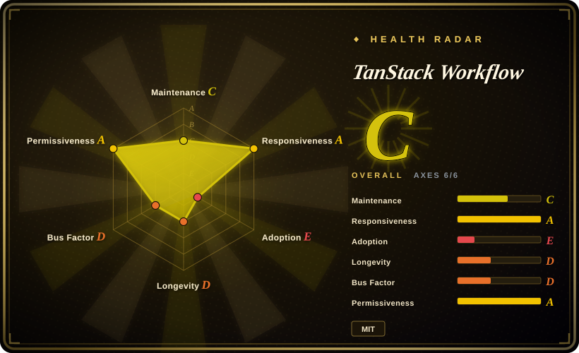
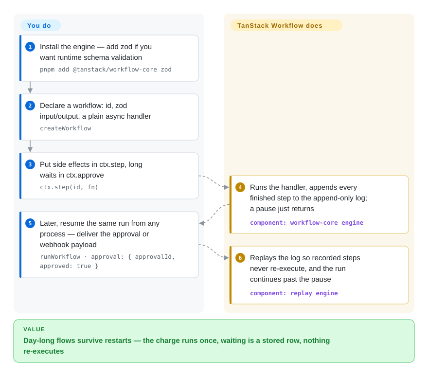

# TanStack Workflow

Your checkout flow is mid-way through waiting for a payment webhook when a deploy kills the process — the promise is gone, the approval state with it, and the charge has to be replayed by hand. TanStack Workflow appends every finished step of an ordinary async TypeScript function to an event log in a store you own, so the run can resume after any restart: completed steps are never re-executed, and a pause — sleep, webhook, human approval — is a row in your database, not a live promise.

## When to use

You're shipping a TypeScript product — an order-fulfillment flow in a TanStack Start app, an AI agent that must pause for a human before publishing, a payment that waits days for a webhook — and the process that runs the code does not live as long as the flow it runs. Today that means a status column, a cron that polls it, hand-rolled idempotency keys, and a state machine nobody can read. TanStack Workflow collapses that into language-native code: `createWorkflow({...}).handler(async ctx => ...)` with side effects inside `ctx.step(id, fn)` and waits expressed as `ctx.sleep`, `ctx.waitForEvent`, `ctx.approve`. The engine records each finished operation to an append-only log; on resume it re-runs the handler and replays past the completed work, so your long flow survives deploys, crashes and serverless cold starts without a long-lived process.

The choice against the durable-execution incumbents is *where the durability boundary lives*. Temporal, Inngest, Trigger.dev and Cloudflare Workflows make you adopt a platform — a server you operate, or vendor-managed state you cannot take with you. This is the headless option: a library in your app, an event log in your own Postgres (or D1), and the same workflow code portable across Node, Cloudflare, Railway, Netlify and Vercel. If your stack is already TypeScript and TanStack-shaped (headless core, per-framework layers), the primitives will feel native; if you want the workflow platform to own execution and operations, pick one of the platforms instead.

## How it works

You write three things — a workflow definition (`createWorkflow` with zod input/output schemas), a plain async handler whose side effects go through `ctx.step`, and waits through `ctx.approve` / `ctx.waitForEvent` / `ctx.sleep`. The engine does the rest at run time: it executes the handler and appends every durable fact — step results, recorded times and UUIDs, delivered signals and approvals — to an append-only event log in a `RunStore` you supply; workflow state is never stored directly, it is *derived* by replaying that log. Resuming a run re-executes the handler from the top, but each `ctx.step` whose result is already in the log returns the recorded value without calling your function again — think of it as a tape recorder: rewind and play, and the frames already on the tape don't re-film. For production the runtime package (`@tanstack/workflow-runtime`) adds the operational layer: registered workflows and schedules, a store contract covering leases/timers/signals, and a bounded `runtime.sweep()` that a host cron wakes to fire due timers and schedules. The engine ships no cron daemon and no dashboard — you bring the store (in-memory for tests, Drizzle/Postgres or Cloudflare D1 in production), the host scheduler, and idempotency on external effects (feed `stepCtx.id` to the callee as an idempotency key; replay skips recorded steps but does not make arbitrary side effects exactly once).

<!-- flow-steps:begin (generated from flows/tanstack-workflow.json by tools/flow_card.py — do not edit) -->

Text version of the flow

1. **You**: Install the engine — add zod if you want runtime schema validation — `pnpm add @tanstack/workflow-core zod`
2. **You**: Declare a workflow: id, zod input/output, a plain async handler — `createWorkflow`
3. **You**: Put side effects in ctx.step, long waits in ctx.approve — `ctx.step(id, fn)`
4. **TanStack Workflow**: Runs the handler, appends every finished step to the append-only log; a pause just returns — component: `workflow-core engine`
5. **You**: Later, resume the same run from any process — deliver the approval or webhook payload — `runWorkflow · approval: { approvalId, approved: true }`
6. **TanStack Workflow**: Replays the log so recorded steps never re-execute, and the run continues past the pause — component: `replay engine`

**Value**: Day-long flows survive restarts — the charge runs once, waiting is a stored row, nothing re-executes

<!-- flow-steps:end -->

<!-- flow-steps:begin (generated from flows/tanstack-workflow.json by tools/flow_card.py — do not edit) -->
<!-- flow-steps:end -->

## When NOT to use

- **You need a mature control plane today** — run search, replay-from-dashboard, retention tooling, pause/resume/backfill schedule controls, multi-language SDKs. Use [Temporal](temporal.md): TanStack's own docs matrix marks its run-operations and schedule-controls as partial, and devtools are "planned capability packages". Temporal trades your Postgres-and-cron assembly for a cluster you operate.
- **You want queues, concurrency keys and observability pre-assembled.** Inngest, Trigger.dev and Cloudflare Workflows ship durable queues and backpressure as products; here durable queues/concurrency controls are 🟡 on the project's own matrix and Redis/queue adapters sit on a roadmap. If that assembly is more ops than you want, pick a platform.
- **You need compensation (saga undo), durable step retries, or signals that arrive before the workflow waits for them — today.** As of 2026-09-23 the open issue #19 states signals arriving before a matching wait are rejected, retry attempts "live only in memory", and "workflows have no durable compensation primitive"; `ctx.compensate`/`retry.durable`/`bufferSignals` are proposed, not shipped — the repo description's "compensable steps" is aspirational. Use Temporal (compensation via saga patterns) or Restate until it lands.
- **Your workflows aren't TypeScript.** The engine is TS-only (npm packages, TypeScript language metadata); a Python or Go durable flow is better served by [Temporal](temporal.md) SDKs or DBOS (both languages, `not indexed`).
- **You're orchestrating scheduled batch data pipelines with a DAG UI.** That's [Apache Airflow](airflow.md) / [Dagster](dagster.md) / [Prefect](prefect.md) territory — asset lineage, backfills and scheduler-first thinking are absent here by design; this engine is request-scoped app workflows.
- **You cannot give external effects an idempotency key.** Durable execution is at-least-once *around* recorded steps: a third-party call without a dedupe boundary can double-charge on retry regardless of the log. No substitute fixes a non-idempotent callee — make the callee idempotent or wrap it in a recorded step with a stable id.

## Comparison

| Alternative | In index | Our verdict | Tradeoff |
|---|---|---|---|
| [Temporal](temporal.md) | ✅ | Pick Temporal when you need a proven control plane — multi-language workers, run search/replay UI, retention, schedule backfills — and can operate its cluster; pick TanStack Workflow when durability must live inside your existing TypeScript app and its Postgres, with no workflow server to run. | Temporal buys battle-tested operations at the cost of a dedicated server and worker deployment model; this inverts the trade — zero new infrastructure, but the operations surface (dashboards, queueing, compensation) is still ahead of it. |
| Inngest (`inngest/inngest`) | not indexed | Pick Inngest for event-driven serverless functions where the platform manages steps, retries and observability; pick TanStack Workflow when you refuse to bind your execution history to a vendor platform and want your own store. | Not added in this tab-intake batch. Inngest trades portability for a managed event-workflow DX; the headless-vs-platform boundary is the whole decision. |
| Trigger.dev (`triggerdotdev/trigger.dev`) | not indexed | Pick Trigger.dev when background tasks need ready-made queues, concurrency keys and a replay dashboard; pick TanStack Workflow when the workflows are an embedded layer of the HTTP/serverless app you already deploy. | Not added in this tab-intake batch. Trigger.dev is self-hostable but still a task platform with its own service boundary; this is a library inside your app. |
| Cloudflare Workflows | not a repo | Pick Cloudflare Workflows when your app already lives entirely in Workers and platform lock-in is acceptable; pick TanStack Workflow when the same workflow code must run on Node, Vercel, Railway or your own database. | Not a repository — a managed feature of the Cloudflare platform (state lives in Cloudflare), so it is out of this index by shape. |
| DBOS (`dbos-inc/dbos-transact-ts`) | not indexed | When you want embedded Postgres-backed durable functions, DBOS is the closest architectural peer — pick it if you need Python too or its queue/maturation story; pick TanStack Workflow for the TanStack-style typed primitives (approvals, signals, version routing) across more serverless hosts. | Not added in this tab-intake batch. Both live inside your app against your database; DBOS leans database-architecture, this leans portable workflow primitives with adapter breadth. |

## Tech stack

- **Language / shape:** TypeScript monorepo, pnpm workspace + Nx, Changesets-driven releases (verified from repo tree and release tags, 2026-09-28).
- **Core engine (`@tanstack/workflow-core`):** depends only on `@standard-schema/spec`; peer `@opentelemetry/api ^1.9` (verified in `packages/workflow-core/package.json`, 2026-09-28). Schema validation is library-agnostic via the Standard Schema interface — zod is the documented example.
- **Persistence:** append-only JSON event log with optimistic CAS on `expectedNextIndex`; `RunStore` (core) and `WorkflowExecutionStore` (runtime) contracts; shipped stores: in-memory, Drizzle/Postgres, Cloudflare D1 — the last two self-described experimental.
- **Host adapters:** `@tanstack/workflow-vercel` (route handler + cron config), `@tanstack/workflow-netlify` (scheduled function), `@tanstack/workflow-cloudflare` (Worker `scheduled()`), `@tanstack/workflow-railway` (cron command) — all 0.0.x, all published on npm as of 2026-09-28.
- **Observability:** OpenTelemetry spans (`tanstack.workflow.*`) with payload-redacted-by-default attributes; the app owns the SDK/exporter.
- **Framework surface:** the repo description lists React/Solid/Vue/Svelte, but the README states framework bindings and devtools are "planned as follow-up packages"; the in-repo `packages/*-template*` dirs are example scaffolding, not published workflow packages.

## Dependencies

- **Nothing required for the core path:** the engine runs in-process in any JS runtime with the in-memory `RunStore` — good for tests and prototypes only (runs expire after a 1h TTL by default).
- **Production adds two things you must already operate:** a durable store — Postgres (apply the package-owned `workflow_*` migrations; they are not auto-created on sweep) or Cloudflare D1 — and *something that wakes the runtime*: host cron, Vercel Cron, Cloudflare Cron Triggers, Netlify Scheduled Functions, Railway cron or an interval in a worker calling bounded `runtime.sweep()`. The engine deliberately ships no cron daemon.
- **No vendor service:** no egress to a TanStack-hosted control plane; tracing is a no-op unless your app configures OpenTelemetry.

## Ops difficulty

**Medium — and it is honest about that.** Embedding the library is npm-install easy, but the production durability story is yours to assemble: store migrations owned by the package but applied by you, sweeps budgeted under the host's timeout (`maxDurationMs`), lease-based stale-run recovery, retention policy per store, and version routing (`previousVersions`) kept alive while old runs are in flight. There is no dashboard or run-operations UI yet, so debugging means reading event logs and OTel spans yourself. Everything is 0.0.x with adapters self-labelled experimental — pin versions and re-test durability semantics on every bump.

## Health & viability

- **Maintenance (2026-09-28):** two bursts, then quiet. Created 2026-05-20; 0.0.1 released 2026-05-22, the 0.0.3–0.0.5 adapter batch 2026-07-21; the default branch's last commit is 2026-07-21 — ~9 weeks before measurement — while `pushed_at=2026-09-23` shows active non-default branches (`taren/durable-recovery`) and issue #19 opened the same day. Work continues, nothing has landed on `main`.
- **Governance / bus factor:** the contributors API lists exactly one human — tannerlinsley (39 commits) — plus the CI bot (2026-09-28). Effectively a one-person project under an org umbrella; CODEOWNERS routes CI/lockfile/publish paths to `@TanStack/tanstack-core`, and CI runs zizmor — supply-chain hygiene is real, headcount is not.
- **Backing & Lindy:** TanStack organization, docs footer © 2026 TanStack LLC, partner-backed and sponsor-supported. The repo is 4 months old — no Lindy on itself; the prior leans on the org's multi-year track record (Query/Router/Table are ecosystem staples).
- **Adoption (dated):** 213 stars / 6 forks / 1 watcher as of 2026-09-28 — tiny even by TanStack standards; 8,680 npm downloads for `@tanstack/workflow-core` in the 2026-08-29→2026-09-27 window (npm API, measured this pass). Docs site presents itself as "alpha / v0".
- **Risk flags:** all packages 0.0.x; adapters self-described experimental; release gap since 2026-07-21; the repo description claims "compensable steps" and Vue/Svelte bindings that the shipped code does not yet have (see issue #19 and README); deployment docs prioritize "partner environments" (Cloudflare/Railway/Netlify) — a fact from the deployment guide; its roadmap implication is logged below.

## Caveats (unverified)

- [未验证：未核实贡献者身份] The identity and affiliation of "taren" (author of the `taren/*` branches feeding PRs #13/#15 and the open recovery work) — the contributors list on `main` shows only tannerlinsley plus the CI bot.
- [未验证：未读适配器源码] Whether the published store/host adapters pass the durability contract (CAS append, lease recovery, bounded sweeps) outside the in-repo deployment POCs — versions and docs verified, source not read.
- [推断：依据 packages/ 目录命名与 README Status 段] The `packages/react-template` / `solid-template` (+devtools) dirs are example scaffolding rather than framework bindings; the README's "planned as follow-up packages" is the anchor.
- [未验证：缺复现环境] Real-world durability claims (exactly-once *around* steps via idempotency keys, crash-mid-step semantics) are taken from the repo's own docs; not reproduced.
- [推断：依据 npm 下载量、无 case study、docs 自标 alpha] Production adoption is currently near-zero; the download count includes CI/bot traffic and is an upper bound.
- [未验证：仅代理抓取首页] The tanstack.com/workflow docs site was fetched via one proxied page render (its "213 GitHub stars" figure matches the repo API); a full docs crawl was not done.
- [推断] The Inngest / Trigger.dev / DBOS rows are positioning judgments from TanStack's own docs/comparison.md plus general ecosystem knowledge; rival claims in that one-sided table were not verified against the rivals' repos.
- [推断：依据 deployment.md 的 partner 措辞与 FUNDING.yml 的赞助模式] The "partner environments first" prioritization implies a partner-funded roadmap; no contract or funding document was found to confirm it.
