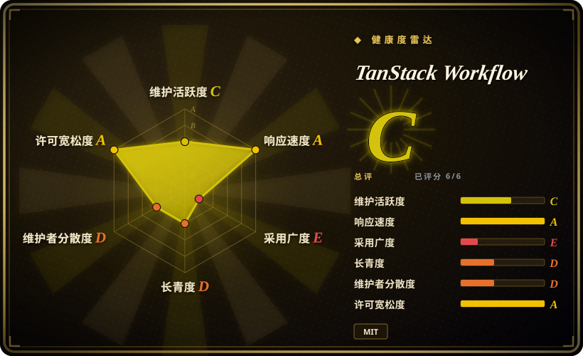
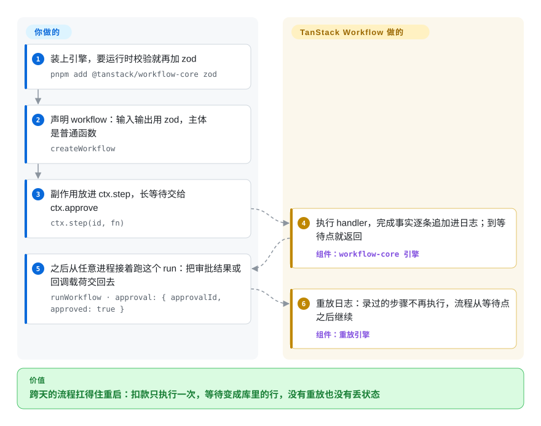

# TanStack Workflow

订单流程正等着支付回调，一次发版把进程杀了——promise 没了，审批状态也没了，扣款只能人工重放。TanStack Workflow 把普通 async TypeScript 函数里每一步的完成事实追加写进你自己数据库里的事件日志：进程重启后从日志恢复，完成的步骤绝不重跑，而「等待」——定时、回调、人工审批——只是库里的一行记录，不是一个活着的 promise。

## 何时使用

你在维护一个 TypeScript 产品——TanStack Start 应用里的订单履约流、必须先过人工审批才能发布的 AI agent、要等好几天的支付回调——而跑代码的进程活得没有流程长。今天这意味着一张状态表、一个轮询它的 cron、散落各处的幂等 key，和一个没人读得懂的状态机。TanStack Workflow 把这些收回语言本身：`createWorkflow({...}).handler(async ctx => ...)`，副作用写进 `ctx.step(id, fn)`，等待用 `ctx.sleep`、`ctx.waitForEvent`、`ctx.approve` 表达。引擎把每个完成的操作追加进只追加日志；恢复时重跑 handler、从日志里跳过已完成的步骤，于是跨部署、崩溃、serverless 冷启动，长流程都活得下来——不需要一个长期活着的进程。

相对持久执行（durable execution）阵营的现有玩家，这个选择的分水岭在**持久化边界放在哪**。Temporal、Inngest、Trigger.dev、Cloudflare Workflows 都要求你采纳一个平台——要么自己运维一个 server，要么把执行历史交给厂商托管。这一款是 headless 方案：库嵌在你的应用里，事件日志写在你自己的 Postgres（或 D1）里，同一份 workflow 代码可以在 Node、Cloudflare、Railway、Netlify、Vercel 之间搬。如果你的栈本来就是 TypeScript 且吃 TanStack 那一套（headless 内核加薄薄一层框架粘合），这些原语会非常顺手；如果你想让平台替你掌管执行和运维，就去选平台。

## 怎么用起来

你要写的只有三样：一个 workflow 定义（`createWorkflow` 加 zod 输入输出 schema）、一个普通 async handler（副作用都走 `ctx.step`）、以及 `ctx.approve`／`ctx.waitForEvent`／`ctx.sleep` 这些等待点。运行时都是引擎的活：它执行 handler，把每个「持久事实」——步骤结果、记录下来的时间与 UUID、送达的信号与审批——追加进你提供的 `RunStore` 里的只追加事件日志；workflow 状态从不直接存，而是重放日志推导出来。恢复一个 run 会把 handler 从头再执行一遍，但日志里已有结果的 `ctx.step` 直接返回录存的值、不再调用你的函数——把它想成磁带：倒回去重放，已经录上的画面不会重新拍。生产路径由 runtime 包（`@tanstack/workflow-runtime`）补上运维层：注册好的 workflows 与 schedules、覆盖租约／定时器／信号的存储契约、以及一个有界（bounded）的 `runtime.sweep()`，由宿主的 cron 唤醒去触发到期的定时与调度。引擎不带 cron daemon 也不带 dashboard——store 要你自己选（测试用内存，生产用 Drizzle/Postgres 或 Cloudflare D1）、宿主调度器要你自备、外部副作用的幂等也要你自己保证（把 `stepCtx.id` 作为幂等 key 传给被调方；重放会跳过已记录的步骤，但不会让任意外部副作用变成恰好一次）。

<!-- flow-steps:begin (generated from flows/tanstack-workflow.json by tools/flow_card.py — do not edit) -->

流程文字版

1. **你**：装上引擎，要运行时校验就再加 zod — `pnpm add @tanstack/workflow-core zod`
2. **你**：声明 workflow：输入输出用 zod，主体是普通函数 — `createWorkflow`
3. **你**：副作用放进 ctx.step，长等待交给 ctx.approve — `ctx.step(id, fn)`
4. **TanStack Workflow**：执行 handler，完成事实逐条追加进日志；到等待点就返回 — 组件：`workflow-core 引擎`
5. **你**：之后从任意进程接着跑这个 run：把审批结果或回调载荷交回去 — `runWorkflow · approval: { approvalId, approved: true }`
6. **TanStack Workflow**：重放日志：录过的步骤不再执行，流程从等待点之后继续 — 组件：`重放引擎`

**价值**：跨天的流程扛得住重启：扣款只执行一次，等待变成库里的行，没有重放也没有丢状态

<!-- flow-steps:end -->

<!-- flow-steps:begin (generated from flows/tanstack-workflow.json by tools/flow_card.py — do not edit) -->
<!-- flow-steps:end -->

## 何时不用

- **你现在就要成熟控制平面**——run 检索、从面板重放、保留期工具、调度暂停/恢复/backfill、多语言 SDK。选 [Temporal](temporal.zh.md)：TanStack 自己的文档对比矩阵就把 run 操作和调度控制标成部分支持，devtools 写着「planned capability packages」。Temporal 用你要运维的集群换来了这些。
- **你想要开箱的队列、并发键和可观测性。** Inngest、Trigger.dev、Cloudflare Workflows 把持久队列与背压做成产品自带；本项目自己的矩阵把 durable queues/concurrency 标成 🟡，Redis/queue 适配还在路线图上。不想自己拼这些，就选平台。
- **你今天就需要补偿（saga undo）、持久化的步骤重试、或先于等待到达的信号。** 截至 2026-09-23，open issue #19 写明：早到的信号会被拒收、重试次数「只活在内存里」、「workflows have no durable compensation primitive」；`ctx.compensate`／`retry.durable`／`bufferSignals` 只是提案——仓库描述里的 "compensable steps" 尚未落地。这部分能力落地前，用 Temporal（saga 模式补偿）或 Restate。
- **你的 workflow 不是 TypeScript。** 引擎是纯 TS（npm 包、语言元数据）；Python 或 Go 的持久执行走 [Temporal](temporal.zh.md) SDK 或 DBOS（两种语言都有，`未收录`）更顺。
- **你要编排定时的批处理数据管线加 DAG 界面。** 那是 [Apache Airflow](airflow.zh.md)／[Dagster](dagster.zh.md)／[Prefect](prefect.zh.md) 的地盘——资产血缘、backfill、调度器优先的设计在这里是刻意缺席；这款引擎是请求维度的应用内 workflow。
- **外部副作用给不出幂等 key。** 持久执行在已记录步骤之外是至少一次语义：没有去重边界的第三方调用在重试时照样可能重复扣款，日志救不了。没有替代品能替不幂等的被调方兜底——要么让被调方幂等，要么包进步骤并给它稳定 id。

## 横向对比

| 替代品 | 是否收录 | 我们的评价 | 取舍 |
|---|---|---|---|
| [Temporal](temporal.zh.md) | ✅ | 要经过实战的控制平面——多语言 worker、run 检索/重放面板、保留策略、调度 backfill，且你养得起它的集群，选 Temporal；持久化必须嵌进你现有 TypeScript 应用和它自己的 Postgres、不想再多运维一个 workflow server，选 TanStack Workflow。 | Temporal 用专用 server 与 worker 部署模型换来久经考验的运维面；本页项目恰好反转：零新增基础设施，但控制平面能力（面板、队列、补偿）还在后面。 |
| Inngest（`inngest/inngest`） | 未收录 | 要事件驱动的 serverless 函数、步骤/重试/可观测性由平台托管，选 Inngest；拒绝把执行历史绑在厂商平台上、要用自己的存储，选 TanStack Workflow。 | 本 tab-intake 批次未收录。Inngest 拿可移植性换托管的事件 workflow 体验；headless 还是平台，就是这道题的全部。 |
| Trigger.dev（`triggerdotdev/trigger.dev`） | 未收录 | 后台任务要现成的队列、并发键和重放面板，选 Trigger.dev；workflow 是你已经在部署的 HTTP/serverless 应用的内嵌层，选 TanStack Workflow。 | 本 tab-intake 批次未收录。Trigger.dev 可自托管但仍是一个带自身服务边界的任务平台；本页项目是应用内的库。 |
| Cloudflare Workflows | 非仓库 | 应用已经完全活在 Workers 里且接受平台绑定，选 Cloudflare Workflows；同一份 workflow 代码必须跑在 Node、Vercel、Railway 或你自己的数据库上，选 TanStack Workflow。 | 非仓库——Cloudflare 平台的托管功能（状态存在 Cloudflare 侧），按形态不在本索引范围。 |
| DBOS（`dbos-inc/dbos-transact-ts`） | 未收录 | 要「嵌在应用里、Postgres 做底的持久函数」，DBOS 是形态最近的同类——需要 Python 双语言或它的队列/成熟度故事就选它；要 TanStack 风格的带类型原语（审批、信号、版本路由）加更多 serverless 宿主，选 TanStack Workflow。 | 本 tab-intake 批次未收录。两者都住在你的应用和你的数据库之上；DBOS 偏数据库架构，本页项目偏可搬移的 workflow 原语与适配面。 |

## 技术栈

- **语言／形态：** TypeScript monorepo，pnpm workspace 加 Nx，Changesets 驱动发布（2026-09-28 从仓库树与 release tag 验证）。
- **核心引擎（`@tanstack/workflow-core`）：** 依赖只有 `@standard-schema/spec`；peer 依赖 `@opentelemetry/api ^1.9`（2026-09-28 读 `packages/workflow-core/package.json` 验证）。schema 校验经 Standard Schema 接口做到库无关，文档示例用 zod。
- **持久化：** 只追加 JSON 事件日志，写入用 `expectedNextIndex` 乐观 CAS；`RunStore`（core）与 `WorkflowExecutionStore`（runtime）两层契约；随包发的 store：内存、Drizzle/Postgres、Cloudflare D1——后两者自我标注 experimental。
- **宿主适配：** `@tanstack/workflow-vercel`（route handler 加 cron 配置）、`@tanstack/workflow-netlify`（scheduled function）、`@tanstack/workflow-cloudflare`（Worker `scheduled()`）、`@tanstack/workflow-railway`（cron 命令）——全部 0.0.x，2026-09-28 均已发布到 npm。
- **可观测性：** OpenTelemetry span（`tanstack.workflow.*`），属性默认不落 payload；SDK/exporter 由应用自备。
- **框架面：** 仓库描述写了 React/Solid/Vue/Svelte，但 README 明说框架绑定与 devtools 是 "planned as follow-up packages"；仓库内 `packages/*-template*` 目录是示例脚手架，不是已发布的 workflow 包。

## 依赖

- **核心路径零必备：** 引擎在任意 JS 运行时进程内执行，配 in-memory `RunStore`——只适合测试与原型（run 默认 1h TTL 后过期）。
- **生产要补两样你自己运维的东西：** 一个持久 store——Postgres（包自带 `workflow_*` migration，要手动 apply，sweep 不会建表）或 Cloudflare D1——外加**唤醒 runtime 的东西**：宿主 cron、Vercel Cron、Cloudflare Cron Triggers、Netlify Scheduled Function、Railway cron 或 worker 里一个 interval，调有界的 `runtime.sweep()`。引擎刻意不带 cron daemon。
- **没有厂商服务：** 不向任何 TanStack 托管控制平面出网；不配 OpenTelemetry 则 tracing 是 no-op。

## 运维难度

**中等——而且它对此坦诚。** 嵌库是 npm-install 级别的简单，但生产持久化的故事要你自己拼：schema migration 归包所有、由你负责在上线前 apply；sweep 要预算在宿主超时之内（`maxDurationMs`）；僵死 run 靠租约恢复；保留策略由 store 定；版本路由（`previousVersions`）要在旧 run 未跑完前一直留着代码。目前还没有 dashboard 或 run 操作界面，排障就是自己读事件日志加 OTel span。一切皆 0.0.x、适配层自我标注 experimental——每个版本都要 pin 住并回归验证持久化语义。

## 健康度与可持续性

- **维护（2026-09-28）：** 两波冲刺后沉寂。仓库创建于 2026-05-20；0.0.1 发布于 2026-05-22，0.0.3–0.0.5 适配层批次发布于 2026-07-21；默认分支最后一次提交是 2026-07-21——距测量约 9 周——而 `pushed_at=2026-09-23` 来自非默认分支（`taren/durable-recovery`）和同日开的 issue #19。活还在干，只是没有落到 `main`。
- **治理／bus factor：** contributors API 只列出一个真人——tannerlinsley（39 commits）——外加 CI bot（2026-09-28）。实质是一人项目挂组织名下；CODEOWNERS 把 CI/lockfile/发布路径路由给 `@TanStack/tanstack-core`，CI 跑 zizmor——供应链卫生是真的，人数不是。
- **背书与 Lindy：** TanStack 组织，docs 页脚 © 2026 TanStack LLC，partner-backed、sponsor-supported。仓库只有 4 个月——自身谈不上 Lindy；先验挂在组织多年信誉上（Query/Router/Table 是生态标配）。
- **采用度（带日期）：** 2026-09-28 为 213 stars／6 forks／1 watcher——放在 TanStack 里也算很小；`@tanstack/workflow-core` npm 下载 8,680 次（2026-08-29→2026-09-27 窗口，npm API，本次实测）。docs 站点自我标注 "alpha / v0"。
- **风险信号：** 全部包 0.0.x；适配层自标 experimental；自 2026-07-21 无新发布；仓库描述声称的 "compensable steps" 与 Vue/Svelte 绑定在已发布代码里尚不存在（见 issue #19 与 README）；部署文档把 "partner environments"（Cloudflare/Railway/Netlify）排在前面——这句是 deployment 文档的事实，其路线图含义记在下方存疑账本。

## 存疑（未验证）

- [未验证：未核实贡献者身份] "taren"（`taren/*` 分支的作者，对应 PR #13/#15 与进行中的 recovery 工作）的身份与归属——`main` 的 contributors 列表里只有 tannerlinsley 加 CI bot。
- [未验证：未读适配器源码] 已发布的 store/host 适配在仓库内 deployment POC 之外是否真能通过持久化契约（CAS append、租约恢复、有界 sweep）——版本与文档已核实，源码未读。
- [推断：依据 packages/ 目录命名与 README Status 段] `packages/react-template`／`solid-template`（含 devtools）目录是示例脚手架而非框架绑定；依据是 README 的 "planned as follow-up packages"。
- [未验证：缺复现环境] 真实世界的持久化主张（靠幂等 key 在步骤外逼近恰好一次、崩溃在步骤中途的语义）取自仓库自己的文档，未复现。
- [推断：依据 npm 下载量、无 case study、docs 自标 alpha] 当前生产采用度接近零；下载量含 CI/bot 流量，只能当上限。
- [未验证：仅代理抓取首页] tanstack.com/workflow 文档站只经代理渲染抓到单页（其 "213 GitHub stars" 与仓库 API 一致），未整站爬取。
- [推断] Inngest／Trigger.dev／DBOS 各行是基于 TanStack 自家 docs/comparison.md 加通用生态认知的定位判断；那张单方表格里的竞品主张未对着竞品仓库核实。
- [推断：依据 deployment.md 的 partner 措辞与 FUNDING.yml 的赞助模式] 「partner environments 优先」暗示路线图受合作方牵引；没有找到合同或资助文档可证实。
