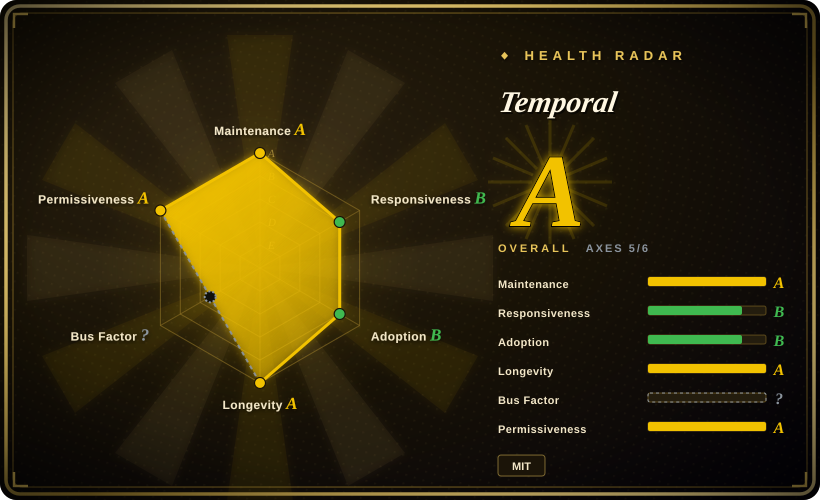
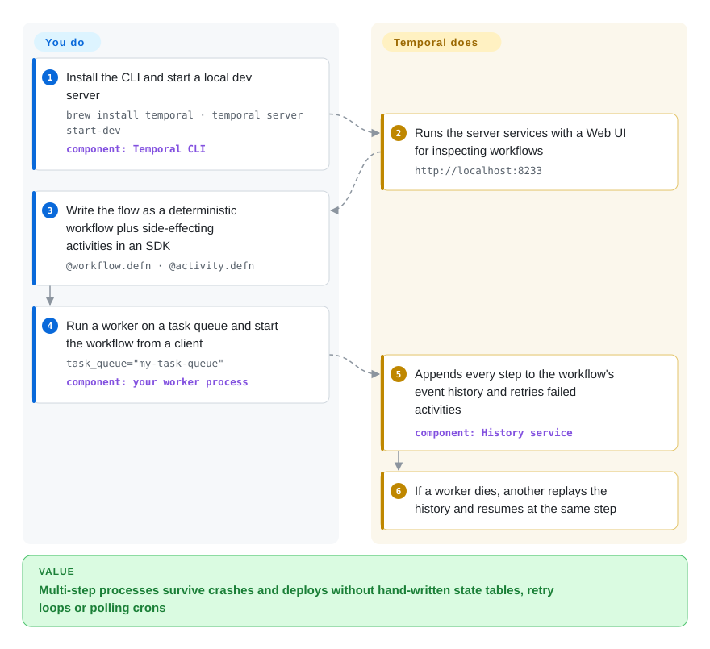

# Temporal

Your order flow charges the card, then a deploy kills the process before it reserves stock — and to make that safe you end up writing a status column, a cron job that polls it, a retry loop and an idempotency key for every step. Temporal lets you write the whole flow as ordinary code: its server records each completed step, and if the process running your code dies, another one replays that record and carries on from exactly the step where it stopped.

## When to use

You're a backend engineer on payments, order fulfilment, account provisioning or a long-running AI agent, and the business process spans many calls and a long time: charge, reserve, ship, wait three days for a delivery webhook, refund if it never comes. Today it is a `orders.status` column with values like `PAYMENT_CAPTURED_AWAITING_STOCK`, a cron that scans for stuck rows, and an incident every time a deploy lands mid-flow. With Temporal you write that process as one function in Go, Java, Python, TypeScript or .NET — including `sleep` for three days and waiting on a signal — and the Temporal server makes it *durable*: every step's result is persisted, failed calls are retried by policy, and a crashed worker's workflow resumes elsewhere.

Pick Temporal over [Airflow](airflow.md) or [Prefect](prefect.md) when the unit is *application logic that must survive failures step by step*, not a scheduled batch pipeline with a DAG view and backfills. Pick it over [TanStack Workflow](tanstack-workflow.md) when you need a polyglot platform with task queues, a Web UI, visibility queries and horizontal scaling rather than a library inside one TypeScript app. The deciding tradeoff: the strongest durability guarantee and the largest SDK ecosystem in this space, paid for with a server cluster to operate (or a Temporal Cloud bill) and a determinism rule your workflow code must obey.

## How it works

Temporal splits your code in two. *Workflows* are the orchestration logic and must be deterministic — given the same inputs and history, they make the same decisions, so no direct clock reads, random numbers or network calls inside them. *Activities* are the steps with side effects (charge a card, call an API) and may fail and be retried. You run both inside your own *worker* processes, built with a Temporal SDK; workers poll a named *task queue* on the server for work. The server — the `temporal` Go binary with Frontend, History, Matching and internal-worker services over a database — does the durable part: it appends every event of a workflow (activity scheduled, completed, timer fired, signal received) to an append-only *event history*, enforces timeouts and retry policies, and hands tasks to whichever worker is polling. Think of it as a video game's autosave: if a worker crashes, another worker loads the save by replaying the history through your workflow code — completed activities are not re-run, their recorded results are reused — and play continues from the same step. What stays yours: the worker fleet, keeping workflow code deterministic (and using the SDKs' versioning tools when you change it), and, if you self-host, the server cluster and its database.

<!-- flow-steps:begin (generated from flows/temporal.json by tools/flow_card.py — do not edit) -->

Text version of the flow

1. **You**: Install the CLI and start a local dev server — `brew install temporal · temporal server start-dev` — component: `Temporal CLI`
2. **Temporal**: Runs the server services with a Web UI for inspecting workflows — `http://localhost:8233`
3. **You**: Write the flow as a deterministic workflow plus side-effecting activities in an SDK — `@workflow.defn · @activity.defn`
4. **You**: Run a worker on a task queue and start the workflow from a client — `task_queue="my-task-queue"` — component: `your worker process`
5. **Temporal**: Appends every step to the workflow's event history and retries failed activities — component: `History service`
6. **Temporal**: If a worker dies, another replays the history and resumes at the same step

**Value**: Multi-step processes survive crashes and deploys without hand-written state tables, retry loops or polling crons

<!-- flow-steps:end -->

## When NOT to use

- **Scheduled batch data pipelines with backfills and a DAG view.** Use [Airflow](airflow.md) or [Prefect](prefect.md) instead of Temporal, because they schedule data jobs by interval and let you re-run date ranges, which Temporal's per-execution model does not offer out of the box.
- **Integration glue that non-engineers should edit.** Use [n8n](n8n.md) instead of Temporal, because n8n ships a visual canvas and connector nodes while every Temporal activity is code someone writes.
- **One TypeScript app, no appetite for running a workflow server.** Use [TanStack Workflow](tanstack-workflow.md) instead of Temporal, because it keeps the event log in your own Postgres or D1 as a library, with no cluster to operate (at the cost of a 0.0.x API and no control-plane UI).
- **Fire-and-forget background jobs** (send an email, resize an image) with no multi-step state. Use [Celery](../task-queue/celery.md) or another job queue instead of Temporal, because a queue with retries is far less machinery than event-sourced workflows.
- **A team that cannot hold the determinism rule.** Changing workflow code while executions are in flight can break replay unless you use the SDK's versioning/patching APIs; if that discipline is unrealistic, a job queue plus explicitly idempotent steps is the safer design.
- **A small team without database operations capacity that wants to self-host.** Production needs Cassandra, MySQL or PostgreSQL (SQLite is dev-only), usually Elasticsearch for visibility, a history-shard count that cannot be changed after setup, and minor-by-minor upgrades. Use Temporal Cloud (not a repo — the vendor-hosted service) or a library-style engine instead of standing up a cluster you cannot staff.

## Comparison

| Alternative | In index | Our verdict | Tradeoff |
|---|---|---|---|
| [Apache Airflow](airflow.md) | ✅ | For interval-scheduled batch pipelines with backfills, pick Airflow; for application workflows that must resume step by step after crashes, pick Temporal. | Airflow gives DAG scheduling, a provider catalog and date-range re-runs; it has no durable-execution replay and is not built for per-request or week-long business flows. |
| [Prefect](prefect.md) | ✅ | For Python data and ML pipelines you want to schedule and observe with minimal ceremony, pick Prefect; for durable, signal-driven business logic in several languages, pick Temporal. | Prefect lets plain Python functions become jobs; it records task states but does not replay workflow code from an event history. |
| [TanStack Workflow](tanstack-workflow.md) | ✅ | When durable flows live inside one TypeScript app and you refuse to run a workflow server, pick TanStack Workflow; when several services and languages share workflows at scale, pick Temporal. | TanStack Workflow is a library over your own store with no cluster; it is 0.0.x with no control-plane UI and leaves timers and operations to you. |
| Cadence | not indexed | When you are already on Uber's Cadence, staying put is reasonable; for a new adoption pick Temporal, which forked from Cadence and has the larger SDK and cloud ecosystem. | Cadence (Apache-2.0, Go) shares the same model and is still maintained; it has a smaller community and fewer official SDKs. |
| Restate | not indexed | When you want a single-binary durable-execution server and can accept a Business Source License, consider Restate; when you need MIT licensing and a long production track record, pick Temporal. | Restate (Rust, created 2023-01) is lighter to run; it is younger, and BSL-1.1 restricts some commercial uses that MIT does not. |

## Tech stack

- **Go** — server module `go.temporal.io/server`, `go 1.27.0` in `go.mod` (2026-10); MIT-licensed, copyright Temporal Technologies and Uber.
- **Services** — Frontend (gRPC API gateway), History (sharded owners of workflow state and event histories), Matching (task queues), and an internal Worker service; one binary can run all of them or each separately.
- **Persistence plugins** — Cassandra, MySQL and PostgreSQL for production, SQLite for development and testing.
- **Visibility store** — SQL (MySQL 8.0.17+, PostgreSQL 12+, SQLite) or Elasticsearch, for listing and querying workflows by search attributes.
- **gRPC** — the protocol between SDKs/workers and the server.
- **Tooling** — the `temporal` CLI (which also bundles the `start-dev` server) and a Web UI that runs as its own process (the "Temporal UI Server" named in release notes).

## Dependencies

- **A database** — Cassandra 3.11/4.0/5.0.4+, PostgreSQL 13–16 or MySQL 5.7/8.0 for production; the dev server runs on SQLite.
- **Elasticsearch** — optional since 1.20, but the docs recommend it as the production visibility store.
- **Your worker processes** — built with an SDK (Go, Java, Python, TypeScript, .NET and others) and deployed by you, where all your workflow and activity code runs.
- **Temporal Web UI server and CLI** — for operators to inspect, signal, reset and terminate executions.
- **Metrics/observability stack** — the server emits metrics you are expected to scrape and alert on when self-hosting.

## Ops difficulty

**High when self-hosted, low on Temporal Cloud.** Locally, `temporal server start-dev` is one command. In production you run four services that scale independently, a database whose schema must be migrated with each upgrade, often an Elasticsearch cluster, and the Web UI. Two decisions are hard to undo: the number of history shards is fixed when the cluster is created, and upgrades must go one minor version at a time (patch to the latest of your current minor first). Releases ship patch lines for several minors at once (1.30.7 and 1.31.3 on 2026-09-18, after 1.32.0 on 2026-09-11), and 1.32.0 flipped visibility query defaults, so read release notes before each hop. On the application side, worker deployments and workflow-code versioning are permanent work, Cloud or not.

## Health & viability

- **Maintenance**: Grade A — commits in all 13 of the last 13 weeks and on the day of the 2026-10-08 re-score; 1.32.0 shipped on 2026-09-11 with patch releases for the 1.30 and 1.31 lines a week later.
- **Responsiveness**: Grade B — median first response 119.3 hours (about five days) across 33 qualifying issues, slower than the previous run's 52.1 hours.
- **Adoption**: Grade B — 5,216,156 pulls of the `temporalio/temporal` Docker image, 1,088,599 release-asset downloads and 30 dependents of `go.temporal.io/server`; ~23.5k GitHub stars (2026-10). Most users consume SDKs and Temporal Cloud, which these server-side counts do not see.
- **Longevity**: Grade A — 2548 days old (created 2019-10), and its design descends from Uber's Cadence (2017): a long, still-active lineage and a strong Lindy prior.
- **Governance**: Cannot be scored this run — GitHub's contributor statistics came back empty (`empty_or_gated`). The all-time contributor list shows a broad bench of engineers (top contributor 935 commits, tenth 236), but the roadmap belongs to one company, Temporal Technologies, which also sells Temporal Cloud.
- **Risk / License**: Grade A — MIT, no relicense in the last 36 months. The commercial pull is toward Temporal Cloud, not toward relicensing the server.

## Caveats (unverified)

- [未验证] SDK language list (Go, Java, Python, TypeScript, .NET and others) is taken from the 1.32.0 release notes' minimum-SDK table plus the docs link; the full official list was not re-read.
- [推断] The claim that Elasticsearch is "usually" deployed in production follows the docs' recommendation, not a survey of real deployments.
- [推断] The Adoption grade undercounts usage because SDK installs and Temporal Cloud traffic are invisible to server-side download and Docker-pull counts.
- [未验证] Restate's and Cadence's descriptions (including "fewer official SDKs" for Cadence) rest on their GitHub metadata and LICENSE files (BSL-1.1, Apache-2.0), not on a reread of their docs.
- [推断] The responsiveness slowdown (52.1 to 119.3 hours) may reflect sampling noise across two small issue windows rather than a real trend.
