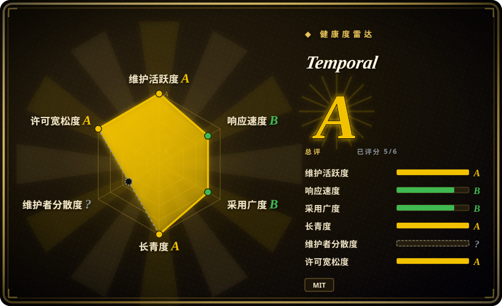
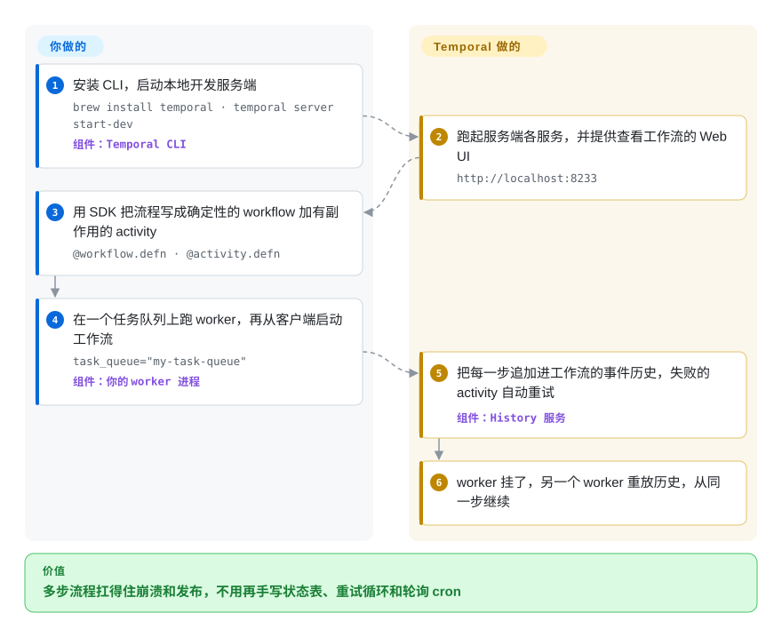

# Temporal

你的下单流程刚扣完款，一次发布就把进程杀了，库存还没锁——为了让这种情况不出事，你最后写出了一个状态字段、一个轮询它的 cron、一圈重试循环，外加每一步一个幂等键。Temporal 让你把整个流程写成普通代码：服务端记下每一个已完成的步骤，跑你代码的进程一旦挂掉，另一个进程会按这份记录重放，从停下的那一步原样接着跑。

## 何时使用

你是做支付、订单履约、开户开通或长时间运行的 AI agent 的后端工程师，业务流程横跨很多次调用、持续很长时间：扣款、锁库存、发货、等三天的签收 webhook，等不到就退款。现在它是 `orders.status` 字段里一串 `PAYMENT_CAPTURED_AWAITING_STOCK` 这样的值、一个扫描卡住记录的 cron，以及每次发布正好撞上流程中途时的一场事故。用 Temporal，你可以用 Go、Java、Python、TypeScript 或 .NET 把这个流程写成一个函数——包括“睡三天”和“等一个信号”——由 Temporal 服务端让它变得*持久*：每一步的结果都落盘，失败的调用按策略重试，某个 worker 崩溃了，它手上的工作流会在别处恢复。

和 [Airflow](airflow.zh.md)、[Prefect](prefect.zh.md) 比，当单位是*必须逐步扛住故障的应用逻辑*，而不是带 DAG 视图和回填的定时批处理管线时，选 Temporal。和 [TanStack Workflow](tanstack-workflow.zh.md) 比，当你需要一个多语言平台——任务队列、Web UI、可见性查询、横向扩展——而不是嵌在单个 TypeScript 应用里的库时，选 Temporal。决定性的取舍：这一领域里最强的持久性保证和最大的 SDK 生态，代价是要运维一套服务端集群（或为 Temporal Cloud 付费），以及工作流代码必须遵守的确定性规则。

## 怎么用起来

Temporal 把你的代码一分为二。*Workflow* 是编排逻辑，必须是确定性的——同样的输入和历史一定做出同样的决定，所以里面不能直接读时钟、取随机数或发网络请求。*Activity* 是有副作用的步骤（扣款、调某个 API），允许失败、可以重试。两者都跑在你自己的 *worker* 进程里，用 Temporal SDK 写成；worker 会去服务端的某个具名*任务队列*（task queue）上领活。服务端——Go 写的 `temporal` 程序，包含 Frontend、History、Matching 和内部 Worker 几个服务，底下接一个数据库——负责持久这一半：它把工作流的每个事件（activity 已排期、已完成、定时器触发、收到信号）追加进一份只增不改的*事件历史*，执行超时和重试策略，并把任务派给正在领活的 worker。可以把它想成游戏的自动存档：某个 worker 崩了，另一个 worker 用你的工作流代码重放这份历史来“读档”——已完成的 activity 不会再跑，直接复用记下来的结果——然后从同一步继续。归你管的是：worker 集群、保持工作流代码的确定性（改代码时用 SDK 的版本化工具），以及自托管时的服务端集群和它的数据库。

<!-- flow-steps:begin (generated from flows/temporal.json by tools/flow_card.py — do not edit) -->

流程文字版

1. **你**：安装 CLI，启动本地开发服务端 — `brew install temporal · temporal server start-dev` — 组件：`Temporal CLI`
2. **Temporal**：跑起服务端各服务，并提供查看工作流的 Web UI — `http://localhost:8233`
3. **你**：用 SDK 把流程写成确定性的 workflow 加有副作用的 activity — `@workflow.defn · @activity.defn`
4. **你**：在一个任务队列上跑 worker，再从客户端启动工作流 — `task_queue="my-task-queue"` — 组件：`你的 worker 进程`
5. **Temporal**：把每一步追加进工作流的事件历史，失败的 activity 自动重试 — 组件：`History 服务`
6. **Temporal**：worker 挂了，另一个 worker 重放历史，从同一步继续

**价值**：多步流程扛得住崩溃和发布，不用再手写状态表、重试循环和轮询 cron

<!-- flow-steps:end -->

## 何时不用

- **带回填和 DAG 视图的定时批处理数据管线。** 请改用 [Airflow](airflow.zh.md) 或 [Prefect](prefect.zh.md)，因为它们按时间间隔调度数据任务、能按日期区间重跑，而 Temporal 以单次执行为单位的模型并不直接提供这些。
- **要让非工程师来改的集成胶水。** 请改用 [n8n](n8n.zh.md)，因为 n8n 自带可视化画布和连接器节点，而 Temporal 的每个 activity 都得有人写代码。
- **只有一个 TypeScript 应用，也不想运维工作流服务端。** 请改用 [TanStack Workflow](tanstack-workflow.zh.md)，因为它作为一个库，把事件日志存进你自己的 Postgres 或 D1，没有集群要运维（代价是 0.0.x 的 API，也没有控制面 UI）。
- **发完就不管的后台任务**（发封邮件、缩张图片），没有多步状态。请改用 [Celery](../task-queue/celery.zh.md) 或其他任务队列，因为带重试的队列比事件溯源式的工作流轻得多。
- **团队守不住确定性规则。** 有执行还在跑时改工作流代码，不用 SDK 的版本化/打补丁 API 就可能让重放出错；如果做不到这种纪律，任务队列加显式幂等的步骤是更稳妥的设计。
- **想自托管、但没有数据库运维能力的小团队。** 生产环境需要 Cassandra、MySQL 或 PostgreSQL（SQLite 只用于开发），可见性通常还要 Elasticsearch；history 分片数在建集群后就不能再改；升级必须一个小版本一个小版本地走。请改用 Temporal Cloud（非仓库，厂商托管的服务）或库形态的引擎，而不是硬撑一套没人能照看的集群。

## 横向对比

| 替代品 | 是否收录 | 我们的评价 | 取舍 |
|---|---|---|---|
| [Apache Airflow](airflow.zh.md) | ✅ | 按时间间隔调度、需要回填的批处理管线，选 Airflow；崩溃后必须逐步续跑的应用工作流，选 Temporal。 | Airflow 提供 DAG 调度、provider 目录和按日期区间重跑；它没有持久执行的重放能力，也不是为单次请求或长达一周的业务流程设计的。 |
| [Prefect](prefect.zh.md) | ✅ | 想低成本地定时、观测 Python 数据和机器学习管线，选 Prefect；多语言、由信号驱动的持久业务逻辑，选 Temporal。 | Prefect 能把普通 Python 函数变成任务；它记录 task 状态，但不会从事件历史重放工作流代码。 |
| [TanStack Workflow](tanstack-workflow.zh.md) | ✅ | 持久流程只在一个 TypeScript 应用里、又坚决不跑工作流服务端时，选 TanStack Workflow；多个服务、多种语言大规模共用工作流时，选 Temporal。 | TanStack Workflow 是架在你自己存储上的库，没有集群；但它是 0.0.x，没有控制面 UI，定时器和运维要你自己补。 |
| Cadence | 未收录 | 已经在用 Uber 的 Cadence，留在原地是合理的；新项目选 Temporal，它从 Cadence 分叉而来，SDK 和云生态更大。 | Cadence（Apache-2.0，Go）模型相同，仍在维护；社区更小，官方 SDK 更少。 |
| Restate | 未收录 | 想要单二进制的持久执行服务端、又能接受 Business Source License 时，可以考虑 Restate；需要 MIT 许可和更长的生产记录时，选 Temporal。 | Restate（Rust，2023-01 创建）运行起来更轻；但更年轻，而且 BSL-1.1 对部分商业用途有 MIT 没有的限制。 |

## 技术栈

- **Go**——服务端模块 `go.temporal.io/server`，`go.mod` 写的是 `go 1.27.0`（2026-10）；MIT 许可，版权归 Temporal Technologies 和 Uber。
- **服务**——Frontend（gRPC API 入口）、History（按分片持有工作流状态和事件历史）、Matching（任务队列）以及内部 Worker 服务；可以一个程序全跑，也可以分开部署。
- **持久化插件**——生产用 Cassandra、MySQL、PostgreSQL，开发和测试用 SQLite。
- **可见性存储**——SQL（MySQL 8.0.17+、PostgreSQL 12+、SQLite）或 Elasticsearch，用于按搜索属性列出和查询工作流。
- **gRPC**——SDK/worker 与服务端之间的协议。
- **工具**——`temporal` CLI（自带 `start-dev` 开发服务端），以及作为独立进程运行的 Web UI（发布说明里称为 “Temporal UI Server”）。

## 依赖

- **一个数据库**——生产用 Cassandra 3.11/4.0/5.0.4+、PostgreSQL 13–16 或 MySQL 5.7/8.0；开发服务端跑在 SQLite 上。
- **Elasticsearch**——1.20 起是可选的，但文档推荐它作生产环境的可见性存储。
- **你自己的 worker 进程**——用 SDK（Go、Java、Python、TypeScript、.NET 等）写成、由你部署，所有 workflow 和 activity 代码都在这里跑。
- **Temporal Web UI 服务和 CLI**——供运维人员查看、发信号、重置和终止执行。
- **指标与可观测性栈**——自托管时，服务端吐出的指标需要你自己采集和告警。

## 运维难度

**自托管高，用 Temporal Cloud 低。** 本地一条 `temporal server start-dev` 就够了。生产环境要跑四个各自扩缩容的服务、一个每次升级都要迁移 schema 的数据库，往往还有一个 Elasticsearch 集群，外加 Web UI。有两件事很难回头：history 分片数在集群创建时就定死了；升级必须一个小版本一个小版本地走（先升到当前小版本的最新补丁）。发布会同时给好几个小版本线出补丁（2026-09-11 发 1.32.0 之后，2026-09-18 又发了 1.30.7 和 1.31.3），而且 1.32.0 改了可见性查询的默认行为，所以每跨一步都要先读发布说明。应用这一侧，worker 部署和工作流代码的版本化是长期工作，用不用 Cloud 都一样。

## 健康度与可持续性

- **维护活跃度**：Grade A——最近 13 周每周都有提交，2026-10-08 重算当天也有；1.32.0 于 2026-09-11 发布，一周后 1.30 和 1.31 两条线也出了补丁。
- **响应速度**：Grade B——33 个计分 issue 的首次响应中位数 119.3 小时（约五天），比上一次的 52.1 小时慢。
- **采用广度**：Grade B——`temporalio/temporal` Docker 镜像被拉取 5,216,156 次，发布附件下载 1,088,599 次，`go.temporal.io/server` 有 30 个依赖方；GitHub stars 约 2.35 万（2026-10）。大多数用户用的是 SDK 和 Temporal Cloud，这些服务端侧的计数看不到它们。
- **长青度**：Grade A——仓库已创建 2548 天（2019-10），设计又源自 Uber 的 Cadence（2017）：一条长而仍然活跃的谱系，Lindy 先验很强。
- **治理集中度**：本次无法计算——GitHub 贡献者统计返回为空（`empty_or_gated`）。历史贡献者名单显示有一批分布较广的工程师（头号贡献者 935 次提交，第十名 236 次），但路线图归一家公司 Temporal Technologies 所有，它同时在卖 Temporal Cloud。
- **许可风险**：Grade A——MIT，最近 36 个月没有改许可。商业上的牵引力在 Temporal Cloud，而不在给服务端改许可证。

## 存疑（未验证）

- [未验证] SDK 语言列表（Go、Java、Python、TypeScript、.NET 等）取自 1.32.0 发布说明里的最低 SDK 版本表和文档链接，没有重读完整的官方列表。
- [推断] “生产环境通常会部署 Elasticsearch”依据的是文档推荐，不是对真实部署的调查。
- [推断] 采用广度档位低估了真实用量，因为 SDK 安装量和 Temporal Cloud 流量在服务端下载量和 Docker 拉取量里看不到。
- [未验证] 对 Restate 和 Cadence 的描述（包括 Cadence“官方 SDK 更少”）依据的是它们的 GitHub 元数据和 LICENSE 文件（BSL-1.1、Apache-2.0），本次没有重读它们的文档。
- [推断] 响应速度变慢（52.1 小时到 119.3 小时）可能只是两个小样本 issue 窗口之间的抽样噪声，未必是真实趋势。
